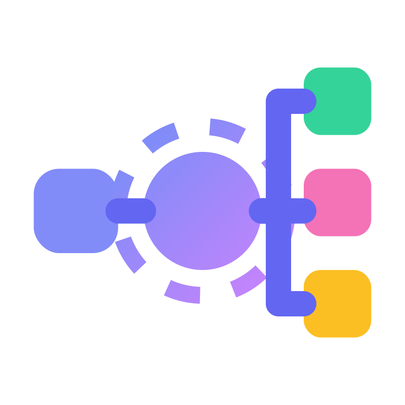

<p align="center">
  
</p>

<h1 align="center">ETL Nexus</h1>

<p align="center">
  <strong>A data architecture command center for discovering, understanding, and consuming ETL pipelines.</strong>
</p>

<p align="center">
  
  
  
  
  
  
  
  
</p>

---

## What is ETL Nexus?

ETL Nexus transforms a static data dictionary into an interactive, engineering-grade workspace. It automatically discovers pipelines from Airflow — reading task definitions, log markers, and dependency graphs — enriches them with schema metadata from an Iceberg catalog, and presents everything through a dark-themed bento-box UI with full SSO, team-based RBAC, and an AI architect terminal.

**Instead of digging through code, Slack threads, and wikis to find data** — open ETL Nexus and get instant answers: what data exists, where it flows, which team owns it, how it's performing, and how to consume it.

Teams (Dagger, Vault, Prism, Relay, Oasis) own pipelines and control visibility. Admins can grant cross-team access per pipeline or per source team. Three roles — `admin`, `member`, `viewer` — gate write operations at both the API and UI layers.

---

### The Workspace

```
 +--[ Pipeline Registry ]--+--[ Bento Workspace ]-------------------------------------------+
 |                         |                                                                 |
 |  Q Search pipelines...  |  [Dagger]  [Network Infra]  [Airflow: Success]  [30d v]  [Sync]|
 |  [All Teams v] [30d v]  |  Bgp Route Sync                                  [Edit Desc]   |
 |                         |                                                                 |
 |  > BgpRouteSync         |  +--[ Topology + Lineage (8 col) ]-------+ +--[ Metrics (4) ]+ |
 |    Network Infra.       |  | [SwitchTelemetryBouncer]              | | Volume            | |
 |    Dagger · Daily       |  |   SwitchPortCollector -->             | | 850K/day          | |
 |                         |  |     [BgpRouteSync]                   | +-------------------+ |
 |  > NetflowCapture       |  |          --> DeviceFingerprintEnrich  | | Schedule          | |
 |    Traffic Analytics    |  |          --> BandwidthBillingAggr     | | daily             | |
 |    Dagger · Daily       |  |   DAG: [all] [backbone] [transit]    | +-------------------+ |
 |                         |  +---------------------------------------+                      |
 |  > DhcpLeaseSync        |                                                                 |
 |    Address Mgmt.        |  +--[ Resource & Performance (full width) ]------------------+ |
 |    Vault · Daily        |  | Run Duration      | Resources          | Capacity          | |
 |    [FAILED]             |  | avg 4m · max 12m  | Driver: 2g / 16g   | ████░░ 12%        | |
 +-------------------------+  | ▃▅▇▅▃▄▅▆▇▅▃▅      | Executor: 4g / 64g | ██░░░░  6%         | |
                               | 12 runs  87% pass | Cores: 2 / 32      | █░░░░░  6%         | |
                               +-------------------+--------------------+-------------------+ |
                               |                                                              |
                               | +--[ Schema + Usage (7 col) ]--+ +--[ Joins + Code (5) ]-+ |
                               | | route_id    STRING           | | Join Intelligence       | |
                               | | prefix      STRING           | | DnsRecordSync           | |
                               | | next_hop    STRING           | |  ON: device_id          | |
                               | | synced_at   TIMESTAMP        | +-------+-----------------+ |
                               | +------------------------------+ | Consume Snippet          | |
                               | | Usage          3 consumers   | | from etls import ..     | |
                               | | 1.2K reads     2 ETL · 1 API | | Catalog(Engine...)      | |
                               | +------------------------------+ +-------------------------+ |
                               |                                                              |
                               | +--[ Execution Plan ]------+ +--[ Documentation ]---------+ |
                               | | HashAggregate            | | # BgpRouteSync              | |
                               | |  Exchange (hashpart.)    | | Ingests BGP routing tables  | |
                               | |   SortMergeJoin          | | from feed bouncers and      | |
                               | |    FileScan iceberg      | | enriches with topology data | |
                               | |    FileScan iceberg      | | [Edit] [History] [Restore]  | |
                               | +--------------------------+ +-----------------------------+ |
                               +--------------------------------------------------------------+
```

---

## Features

### Pipeline Discovery and Search

- **Auto-discovery from Airflow** — the sync service reads every task in every DAG; metadata is keyed by `task_id` (no `etl_name` gate required)
- **Bouncer detection** — tasks where `"Bouncer" in task_id` are classified as data ingestion root tasks; they own `sensor_name` in `op_kwargs` and log `BOUNCER_DESCRIPTION:` markers
- **API endpoint detection** — tasks where `"Api" in task_id` or `"API" in task_id` are skipped for `writes_to` lineage because they are query-only
- **Team assignment** — derived from the TaskGroup prefix: `DaggerCollection` → team `Dagger`; `VaultAnalysis` → team `Vault`
- **Schedule** — read directly from the DAG's native `timetable_description` or `schedule_interval`
- **Dependencies** — from `params` (`needs` = hard dependencies, `prefers` = soft dependencies); not from `op_kwargs`
- **Resources** — Spark allocations come from `op_kwargs.resources`
- **Deep search** — find pipelines by name, description, or any field name (e.g., search `device_id` to see every ETL that exposes it); PostgreSQL GIN/trigram indexes back this
- **Team and date range filtering** in the Pipeline Registry sidebar

### Visual Pipeline Workspace (Bento Layout)

- **Lineage topology** — upstream dependencies (needs/prefers), current pipeline, and downstream consumers in a single interactive view; DAG filter buttons narrow to a specific Airflow DAG
- **Bouncer topology** — dedicated view of data ingestion roots and which ETLs they feed
- **Upstream topology modal** — full-screen expandable view of deep dependency chains
- **Schema structure** — every field with its Iceberg data type, synced every 2 hours
- **Volume and schedule metrics** — rows/day (from bouncer volume seed) and native DAG schedule
- **Consume snippets** — copy-paste Python code for both ETL import and Catalog import patterns:
  ```python
  # Catalog Import
  from etls import Catalog, Engine
  Catalog(Engine.Spark).iceberg.dagger.bgp_route_sync("date").consume().as_pyspark()
  ```
- **Date range filtering** — 24h, 7d, 30d (default), 90d, or custom range applied across pipeline list, resource history, and usage data

### Resource and Performance Tracking

- **Allocated resources** — Spark driver/executor memory, cores, and executors per pipeline per DAG (DAG-specific overrides supported)
- **Run history** — duration stats (avg/min/max), success rate from the last 20 runs with a sparkline chart
- **Actual usage** — real memory/CPU utilization parsed from `ETL_RESOURCE_ACTUAL:` log markers during task execution
- **Cluster capacity bars** — allocated vs. used vs. cluster maximum for driver memory, executor memory, and cores

### Spark Execution Plan Visualization

- **Physical plan tree** — `TransformInspectorCard` renders the full PySpark physical execution plan extracted from running ETLs
- **Node classification** — scan, join, aggregate, exchange, sort, project, and filter node types each have a dedicated formatter component
- **AQE awareness** — plan extraction uses `.executedPlan()` (not `.children()`) to capture the real Adaptive Query Execution plan
- **sparkMeasure metrics** — 15 additional run metrics (task count, spill bytes, shuffle bytes, etc.) from `ch.cern.sparkmeasure`
- **Run selector** — view the plan from any of the last N recorded runs
- **Graceful absence** — returns 404 when no plan is recorded; frontend suppresses the card silently

### Pipeline Documentation

- **Markdown editor** with live preview toggle inside a full-screen `DocumentationModal`
- **Inline description editing** in `BentoHeader` — click to edit, blur to save
- **Revision history** — every save creates a `pipeline_revisions` record; `RevisionHistoryPanel` lists all revisions with timestamps and author
- **Restore** — revert to any prior revision with one click
- **Permission gating** — `canEdit` is derived from team membership; viewers see read-only mode

### Downstream Consumer Tracking

- **Automatic discovery** — downstream consumers derived from Airflow's task dependency graph (`downstream_task_ids`)
- **Usage enrichment** — access counts, descriptions, and usage types (ETL vs. API) from `pipeline_usages`
- **Status visibility** — health of every pipeline that depends on yours

### Join Intelligence

- **Schema matches** — automated cross-catalog field overlap detection (e.g., "Join with DnsRecordSync ON: `device_id`, `zone_name`")
- **AI insights** — LLM-powered semantic join recommendations with business context

### DAG Operations Dashboard

- **Per-DAG summary cards** — run counts, pass/fail rates, task status dots, and schedule for all 6 DAGs
- **Aggregate health bars** — cluster-wide success rate and task distribution at a glance
- **Direct Airflow links** — each DAG card links to the corresponding Airflow UI page

### Bouncer Monitoring

- **Dedicated `BouncersView`** — lists all 8 ingestion bouncers with team badges and volume indicators
- **Bouncer topology** — shows the ETL fanout from each bouncer into downstream processing chains
- **Team filter** — filter bouncers by owning team

### Live Airflow Monitoring

- Real-time DAG run status polling (configurable interval, default 20 min)
- Green/red status indicators on every pipeline in the registry
- Per-pipeline manual sync button for on-demand refresh
- Sidebar Airflow connectivity dot — green when reachable, red on failure
- Graceful degradation when Airflow is unreachable

### Global Schema Matrix

- Cross-pipeline field frequency analysis; spot the most common join keys (`device_id`, `timestamp`, `zone_name`) across your entire catalog
- PostgreSQL trigram indexes make wildcard field searches fast at scale

### AI Architect Terminal

- Natural language queries against your full ETL catalog
- Ask infrastructure questions: *"Which pipelines depend on SwitchPortCollector?"*, *"What fields does the traffic analytics team expose?"*
- Pluggable — works with any OpenAPI-compatible LLM endpoint (OpenAI, Azure OpenAI, Ollama, etc.)
- Rate-limited to 60 requests/minute per IP

### SSO, Teams, and RBAC

- **Keycloak OIDC** — production-grade SSO with JIT user provisioning from JWT claims
- **Dual-issuer support** — internal Docker DNS (`keycloak:8090`) and public URL (`localhost:8090`) both accepted
- **5 teams**: Dagger, Vault, Prism, Relay, Oasis — each owns specific DAGs
- **3 roles**: `admin`, `member`, `viewer` — enforced at DB level with a CHECK constraint and at API level with `require_role`
- **Visibility grants** — admins can grant per-pipeline or per-source-team access at `viewer` or `editor` level
- **Default admin mode** — when SSO is disabled a stable `default-admin` user is returned; no credential check needed for local dev

### Admin Panel

- **Users panel** — list all provisioned users, roles, and team memberships
- **Teams panel** — team roster with member counts
- **Grants panel** — create and revoke visibility grants; per-pipeline or per-source-team targeting with viewer/editor level selection

### Interactive Onboarding

- 9-step guided tour covering: Pipeline Registry, Bento Workspace, Schema Matrix, DAG Dashboard, Bouncer Monitoring, AI Terminal, and Admin Panel (admin-only step)
- Spotlight connectors highlight the relevant UI section for each step
- Stored in `onboarding-store` (Zustand); shown only on first visit

### Security and Observability

- **Rate limiting** via SlowAPI: 200 req/min default, 30 req/min on pipeline sync, 60 req/min on AI chat
- **Request ID middleware** — every response carries `X-Request-ID` for distributed tracing
- **Structured request logging** — method, path, status, duration in milliseconds for every non-health request
- **CORS** configured per environment via `CORS_ORIGINS`

---

## Tech Stack

| Layer | Technology |
|-------|-----------|
| **Backend** | Python 3.12, FastAPI, async SQLAlchemy, asyncpg, Alembic, APScheduler |
| **Frontend** | React 19, TypeScript, Vite, TanStack Query, Zustand, shadcn/ui (base-ui), Tailwind CSS v4 |
| **Catalog** | PySpark 3.5.1, Apache Iceberg (REST catalog), sparkmeasure 0.24 |
| **Auth** | Keycloak OIDC, PyJWT, oidc-client-ts + react-oidc-context |
| **Integrations** | Airflow REST API (pipeline discovery + status), OpenAPI-compatible LLM |
| **Database** | PostgreSQL 16 (31 Alembic migrations) |
| **Packages** | uv (Python), pnpm (Node) |
| **Infrastructure** | Docker Compose with Watch (dev), nginx (prod) |

---

## Quick Start

### Prerequisites

- Docker and Docker Compose v2

### Run in Development

```bash
# Clone the repo
git clone <repo-url> && cd EtlNexus

# Copy environment config
cp .env.example .env

# Start everything
docker compose up
```

That's it. The dev environment includes all 12 services and starts with:

| Service | URL | Credentials |
|---------|-----|-------------|
| **Frontend** | http://localhost:5173 | SSO login (see Keycloak users) |
| **Backend API** | http://localhost:8000/api/health | — |
| **Airflow UI** | http://localhost:8080 | admin / admin |
| **Keycloak Admin** | http://localhost:8090 | admin / admin |
| **Iceberg REST catalog** | http://localhost:8181 | — |
| **PostgreSQL** | localhost:5432 | etlnexus / etlnexus |

#### Dev SSO Users (Keycloak realm: `etlnexus`)

| Username | Password | Role | Team(s) |
|----------|----------|------|---------|
| `alice` | `password` | admin | Dagger |
| `bob` | `password` | member | Vault, Prism |
| `charlie` | `password` | member | Relay |
| `diana` | `password` | member | Oasis |

> If you want to skip SSO during local development, set `SSO_ENABLED=false` in `.env` and the backend returns a stable `default-admin` user automatically — no login screen required.

### File Watching (auto-reload on save)

```bash
docker compose watch
```

Backend files sync automatically (uvicorn reloads on change), frontend files trigger Vite HMR.

### Run in Production

```bash
# Configure external integrations
cp .env.example .env.prod
# Edit .env.prod: real Airflow URL, Iceberg catalog, LLM endpoint, Keycloak realm...

docker compose -f docker-compose.prod.yml --env-file .env.prod up -d
```

Production runs only `backend`, `frontend` (nginx), and `db`. All integrations (Airflow, Iceberg, Keycloak, LLM) point to external services via environment variables.

---

## Configuration

All settings via environment variables (see `.env.example` for the complete reference):

### Core Integration

| Variable | Description | Dev Default |
|----------|-------------|-------------|
| `AIRFLOW_BASE_URL` | Airflow REST API base | `http://airflow-webserver:8080/api/v1` |
| `AIRFLOW_USERNAME` | Airflow basic auth username | `admin` |
| `AIRFLOW_PASSWORD` | Airflow basic auth password | `admin` |
| `AIRFLOW_POLL_INTERVAL_MINUTES` | Sync and poll interval | `20` |
| `AIRFLOW_EXCLUDE_OPERATOR_TYPES` | Operator types skipped during discovery | `EmptyOperator,BranchPythonOperator,...` |
| `ICEBERG_CATALOG_URI` | Iceberg REST catalog endpoint | `http://iceberg-rest:8181` |
| `ICEBERG_NAMESPACE_PREFIX` | Namespace to scan for tables | `dagger` |
| `LLM_API_BASE_URL` | OpenAPI-compatible LLM endpoint | _(empty, optional)_ |
| `LLM_API_KEY` | LLM API key | _(empty)_ |
| `LLM_MODEL` | Model name for the LLM request | `default` |
| `LLM_MAX_TOKENS` | Max tokens for LLM responses | `1024` |

### Spark Cluster Capacity

| Variable | Description | Dev Default |
|----------|-------------|-------------|
| `SPARK_MAX_DRIVER_MEMORY_GB` | Cluster cap: max driver memory | `16` |
| `SPARK_MAX_EXECUTOR_MEMORY_GB` | Cluster cap: max executor memory | `64` |
| `SPARK_MAX_EXECUTOR_CORES` | Cluster cap: max CPU cores | `32` |
| `SPARK_MAX_TOTAL_EXECUTORS` | Cluster cap: max executors | `20` |

### SSO / OIDC (Keycloak)

| Variable | Description | Dev Default |
|----------|-------------|-------------|
| `SSO_ENABLED` | Enable Keycloak OIDC auth | `true` (in docker-compose) |
| `SSO_ISSUER_URL` | Internal issuer (Docker DNS) | `http://keycloak:8090/realms/etlnexus` |
| `SSO_PUBLIC_ISSUER_URL` | Public issuer (browser-facing) | `http://localhost:8090/realms/etlnexus` |
| `SSO_CLIENT_ID` | Keycloak client ID | `etlnexus-app` |
| `SSO_AUDIENCE` | Expected JWT audience | `etlnexus-app` |
| `SSO_GROUPS_CLAIM` | JWT claim for team groups | `groups` |
| `SSO_ROLE_CLAIM` | JWT claim for roles | `realm_access.roles` |
| `SSO_ADMIN_ROLE` | Role name treated as admin | `admin` |

### Cache TTLs

| Variable | Description | Default |
|----------|-------------|---------|
| `CACHE_TTL_SHORT` | Short cache (pipeline list, topology, grants) | `30` seconds |
| `CACHE_TTL_MEDIUM` | Medium cache (schema matrix, dag summary, bouncers) | `60` seconds |
| `CACHE_TTL_AIRFLOW` | Airflow client definition cache | `300` seconds |

---

## Architecture

```
                        ┌──────────────────────────────────────┐
                        │         Browser (React 19 SPA)        │
                        │           port 5173 (dev)             │
                        │  oidc-client-ts  TanStack Q  Zustand  │
                        └────────────────┬─────────────────────┘
                                         │ REST /api   Bearer JWT
                        ┌────────────────▼─────────────────────┐
                        │       FastAPI Backend  port 8000      │
                        │  SlowAPI · CORSMiddleware · RequestID │
                        │  Router → Service → Repository        │
                        └──┬──────┬──────┬────────┬────────────┘
                           │      │      │        │
                     SQL   │      │      │        │  JWKS /
                     ┌─────▼──┐   │      │        │  token introspect
                     │  PG 16 │   │      │        ▼
                     │  :5432 │   │      │  ┌───────────┐
                     └────────┘   │      │  │ Keycloak  │
                                  │      │  │  port 8090│
                     Airflow API  │      │  └───────────┘
                     ┌────────────▼──┐   │
                     │  Airflow      │   │  Iceberg REST
                     │  port 8080    │   ▼
                     └───────────────┘  ┌──────────────┐
                                        │ Iceberg REST │
                                        │  port 8181   │
                                        └──────────────┘
                                              │  (optional)
                                        ┌─────▼────────┐
                                        │  LLM Endpoint│
                                        │  (external)  │
                                        └──────────────┘
```

---

## How Data Flows In

All pipeline metadata originates from **Airflow**. No Git repository is cloned.

### Pipeline Discovery

Every 20 minutes, `AirflowSyncService` runs:

1. **Lists DAGs** — `GET /dags` returns all 6 DAGs
2. **Lists tasks per DAG** — `GET /dags/{id}/tasks` returns all task definitions; infrastructure operators (`EmptyOperator`, etc.) are skipped via `AIRFLOW_EXCLUDE_OPERATOR_TYPES`
3. **Fetches task instances** — reads `rendered_fields` from the latest run for `op_kwargs` (Spark resources) and `params` (dependency declarations)
4. **Auto-discovers every task by `task_id`** — no `etl_name` gate; all PythonOperators are treated as pipelines or bouncers
5. **Classifies each task**:
   - `"Bouncer" in task_id` → bouncer (data ingestion root); reads `sensor_name` from `op_kwargs`
   - `"Api" in task_id` or `"API" in task_id` → API endpoint; skip `writes_to` lineage
   - Everything else → ETL pipeline
6. **Extracts team** from the TaskGroup prefix: e.g., `DaggerCollection` → `Dagger`
7. **Extracts category** from the TaskGroup suffix: e.g., `DaggerCollection` → `Collection`
8. **Reads dependencies** from `params.needs` (hard) and `params.prefers` (soft) — **not** from `op_kwargs`
9. **Parses task logs** for special markers:
   - `ETL_WRITES_TO: table_name` → destination table (lineage edge type `writes_to`)
   - `ETL_DESCRIPTION: text` → human description (fallback: title-cased `task_id`)
   - `BOUNCER_DESCRIPTION: text` → bouncer description
10. **Upserts to PostgreSQL** in 4 passes:
    - Pass 1: Create/update `pipelines` + `reads_from` lineage edges
    - Pass 2: Resolve `source_pipeline_id` on edges (link to pipeline rows)
    - Pass 3: Sync `pipeline_resource_configs` (Spark allocations per DAG)
    - Pass 4: Sync `dag_tasks` table (membership + downstream relationships)

### Status Polling

Same 20-minute cycle, `AirflowService.poll_all_statuses()`:

1. Fetches **5 most recent runs** per DAG for statistics (not just the latest)
2. Maps task states to simplified status (`success` / `failed` / `running` / `unknown`)
3. Records each run in `pipeline_run_history` (duration, start/end timestamps, timezone-aware)
4. Parses `ETL_RESOURCE_ACTUAL: {json}` from logs → actual memory/CPU used per run
5. Parses `ETL_EXECUTION_PLAN: {json}` from logs → physical plan tree
6. Upserts latest status to `airflow_run_statuses`

### Schema Enrichment (Iceberg)

Every 2 hours, `CatalogSyncService`:

1. Connects via PySpark to the Iceberg REST catalog
2. Lists all tables under the configured namespace
3. Reads each table's schema (field names, data types)
4. Matches tables to pipelines by name, updates `pipeline_fields`

### Visibility Filtering

Non-admin users see only the pipelines they are entitled to:

- Their own team's pipelines
- Unassigned pipelines (no team)
- Pipelines or entire teams explicitly granted via `visibility_grants`

`PipelineRepository.list_visible()` builds this filtered query from the user's team memberships and active grants.

---

## Backend Architecture

See [backend/README.md](backend/README.md) for a detailed reference on every router, service, repository, and integration client.

### Three-Layer Pattern

```
HTTP Request
    |
    v
Router  (FastAPI endpoint — validates input, enforces auth, returns response)
    |  Depends(get_current_user)
    v
Service (business logic — aggregates data, computes stats, calls integrations)
    |
    v
Repository (async SQLAlchemy — single-table focus, cacheable queries)
    |
    v
PostgreSQL 16
```

### Key Endpoints

| Endpoint | Returns | Data Source |
|----------|---------|------------|
| `GET /api/pipelines` | Searchable list with Airflow status and success rate | DB + `airflow_run_statuses` |
| `GET /api/pipelines/{id}` | Detail: fields, lineage tables, metadata, team | DB (pipeline + fields + lineage_edges) |
| `GET /api/pipelines/{id}/lineage` | Graph: source nodes → pipeline → target nodes | DB (lineage_edges) |
| `GET /api/pipelines/{id}/topology` | DAG task graph: bouncers → needs → current → downstream | DB (dag_tasks) + status enrichment |
| `GET /api/pipelines/{id}/resources` | Spark configs, run history, capacity bars | DB (resource_configs + run_history) |
| `GET /api/pipelines/{id}/execution-plan` | PySpark physical plan tree for a given run | DB (run_history.execution_plan) |
| `GET /api/pipelines/{id}/joins` | Schema-match join suggestions | DB (pipeline_fields cross-join) |
| `PATCH /api/pipelines/{id}` | Update description or documentation | DB; `updated_by` from JWT |
| `GET /api/pipelines/{id}/revisions/{field}` | Revision history for description or documentation | DB (pipeline_revisions) |
| `GET /api/usage/{etl_name}` | Downstream consumers with access counts | DB (dag_tasks + pipeline_usages) |
| `GET /api/consumers/{etl_name}` | Consumer list (same data, alternate key) | DB |
| `GET /api/schema-matrix` | Fields appearing in 2+ pipelines | DB (pipeline_fields aggregated) |
| `GET /api/airflow/status` | All pipeline statuses + Airflow connectivity | DB (airflow_run_statuses) |
| `GET /api/dag-summary` | Per-DAG run stats and task status distribution | DB + Airflow |
| `GET /api/bouncers` | All bouncer tasks with volume and team data | DB (bouncers table) |
| `GET /api/bouncers/{id}/topology` | ETL fanout from a specific bouncer | DB (dag_tasks) |
| `POST /api/ai/chat` | LLM response with full catalog context | External LLM endpoint |
| `POST /api/pipelines/{id}/sync` | Manual re-sync of one pipeline | Airflow API → DB |
| `GET /api/auth/me` | Current user info, role, and teams | DB (users + user_teams) |
| `GET /api/auth/config` | SSO configuration for frontend OIDC setup | Settings (public endpoint, no auth) |
| `GET /api/teams` | All teams with member counts | DB |
| `GET /api/users` | All users (admin only) | DB |
| `GET /api/visibility/grants` | Active visibility grants | DB |
| `POST /api/visibility/grants` | Create a new grant (admin only) | DB |
| `DELETE /api/visibility/grants/{id}` | Revoke a grant (admin only) | DB |

### Database Schema (31 Migrations)

```
pipelines ──────┬── pipeline_fields         (Iceberg schema columns)
                ├── lineage_edges            (reads_from / writes_to)
                ├── airflow_run_statuses     (latest status per pipeline)
                ├── pipeline_resource_configs (Spark allocations per DAG)
                ├── pipeline_run_history     (every run: duration + sparkMeasure metrics + plan)
                ├── dag_tasks               (DAG membership + dependency graph)
                └── pipeline_revisions      (description / documentation history)

bouncers ───────── (data ingestion roots: sensor_name, volume_per_day)

pipeline_usages    (consumer enrichment: access counts, descriptions)

users ──────────┬── user_teams (M2M join)
                └── teams
                       └── pipelines.team_id (FK)

visibility_grants   (per-pipeline or per-source-team, viewer or editor level)
```

Key migration milestones: `007` (resources + run history), `009` (dag_tasks), `012-013` (sparkMeasure metrics + execution plan), `014` (documentation), `015-017` (users, teams, visibility grants), `027` (pipeline revisions), `028-031` (bouncers table + rename).

### Integration Clients

- **AirflowClient** — persistent `httpx.AsyncClient`, basic auth, 10s timeout, 2 retries, 5-min TTL cache for DAG/task definitions, configurable semaphore for concurrent calls
- **IcebergClient** — PySpark `SparkSession` connecting to REST catalog, lazy initialization
- **LLMClient** — OpenAPI-compatible `POST /chat/completions`, 30s timeout, optional (degrades gracefully when unconfigured)
- **OidcClient** — JWKS caching, dual-issuer validation, PyJWT decode with audience check

### TTL Cache Layer

`cache.py` provides a generic `TTLCache[T]` class backed by a plain dict. Module-level singletons cover the read-heavy paths:

| Cache | TTL | Covers |
|-------|-----|--------|
| `pipeline_list_cache` | 30s (short) | Un-queried pipeline list |
| `topology_cache` | 30s (short) | Topology per pipeline+DAG |
| `grant_level_cache` | 30s (short) | Per-user grant level per pipeline |
| `schema_matrix_cache` | 60s (medium) | Schema matrix response |
| `dag_summary_cache` | 60s (medium) | DAG summary statistics |
| `bouncer_cache` | 60s (medium) | Bouncer list |
| `join_suggestions_cache` | 60s (medium) | Join suggestions per pipeline |
| `task_id_map_cache` | 30s (short) | Lightweight `{task_id → summary}` |

All caches are invalidated after each sync/poll cycle via `cache.clear_all()`.

### Background Tasks (APScheduler)

| Task | Interval | What It Does |
|------|----------|-------------|
| Airflow pipeline sync | 20 min | Discover pipelines, bouncers, lineage, resources, dag_tasks |
| Airflow status poll | 20 min | Fetch 5 recent runs per DAG; record history, actual usage, execution plans |
| Catalog sync | 2 hours | Read table schemas from Iceberg via PySpark, sync `pipeline_fields` |
| Startup catchup sync | 5 min after start (one-shot) | Ensures sync runs even if Airflow is slow to boot |

All tasks share an `asyncio.Lock` — if one is running, the others skip their cycle.

---

## Frontend Architecture

See [frontend/README.md](frontend/README.md) for a detailed reference on every component, hook, store, and API module.

### State Management (Two Systems)

**Server state** via TanStack Query (data from the API):

```
Component → useQuery hook → API function (Axios) → Backend → TTL cache
```

Each hook has a cache key like `["pipeline", id]` with a `staleTime` matching expected sync cadence. Data is automatically refetched when stale or when cache is invalidated after a sync.

**Client state** via Zustand stores (UI-only):

| Store | Holds |
|-------|-------|
| `navigation-store` | Active tab (catalog / matrix / ai / bouncers / dag-summary) |
| `pipeline-store` | Selected pipeline ID, selected DAG ID, search query |
| `ai-store` | Chat message history, `isTyping` flag |
| `auth-store` | Current user info, role, and teams from `GET /api/auth/me` |
| `bouncer-store` | Selected bouncer ID |
| `date-range-store` | Active date preset and computed ISO date strings |
| `onboarding-store` | Whether onboarding has been completed |

### Data Flow: Selecting a Pipeline

```
1. User clicks pipeline in PipelineListItem
2. → pipelineStore.setSelectedPipelineId(id)          [Zustand]
3. → BentoWorkspace renders, calls usePipelineDetail(id)  [TanStack Query]
4. → GET /api/pipelines/{id}
5. → Backend: pipeline row + fields + lineage tables
6. → BentoHeader, SchemaViewer, ConsumeSnippet render
7. → Child cards fire their own hooks:
      useLineage(id)          → GET .../lineage
      useTopology(id, dag)    → GET .../topology
      useResourceMetrics(id)  → GET .../resources
      usePipelineUsage(name)  → GET /api/usage/{name}
      useExecutionPlan(id)    → GET .../execution-plan
      useJoinSuggestions(id)  → GET .../joins
      useRevisions(id, field) → GET .../revisions/{field}
```

### UI Layout

```
┌──────────────┬───────────────────────────────────────────────────┐
│ Sidebar 80px │  Main Content                                     │
│              │                                                   │
│ [Catalog]    │  Tab: Catalog                                     │
│ [Matrix]     │  ┌────────────────┬────────────────────────────┐  │
│ [AI]         │  │ Pipeline       │ Bento Workspace            │  │
│ [Bouncers]   │  │ Registry       │                            │  │
│ [DAGs]       │  │ 400px fixed    │  Row 1: Topology (8col)    │  │
│ [Admin]*     │  │                │         + Metrics (4col)   │  │
│              │  │  [Date Range]  │                            │  │
│              │  │  [Team Filter] │  Row 2: Resources (full w) │  │
│              │  │  Search bar    │                            │  │
│              │  │  Pipeline list │  Row 3: Schema (7col)      │  │
│              │  │  grouped by    │         + Joins (5col)     │  │
│ [Airflow ●]  │  │  category      │                            │  │
│              │  │                │  Row 4: Execution Plan     │  │
│              │  │                │         + Documentation    │  │
└──────────────┴──┴────────────────┴────────────────────────────┘
                                    (* admin tab only for admin role)
```

### Component to Data Source Map

| Component | Hook | API Endpoint | What It Shows |
|-----------|------|-------------|---------------|
| `PipelineRegistry` | `usePipelines(query)` | `GET /api/pipelines` | Searchable list grouped by category with team badges |
| `BentoHeader` | `usePipelineDetail(id)` | `GET /api/pipelines/{id}` | Name, team, description (editable), status, sync button |
| `LineageTopology` | `useLineage` + `useTopology` | `.../lineage` + `.../topology` | Bouncers → needs → current → downstream, with status dots |
| `UpstreamTopologyModal` | `useUpstreamTopology(id)` | `.../topology` | Full-screen upstream dependency view |
| `MetricsCards` | (from detail) | (same as header) | Volume per day, schedule |
| `ResourcePerformanceCard` | `useResourceMetrics(id)` | `GET .../resources` | Duration stats, Spark configs, capacity bars |
| `TransformInspectorCard` | `useExecutionPlan(id)` | `GET .../execution-plan` | PySpark physical plan tree with run selector |
| `SchemaViewer` | (from detail) | (same as header) | Field names + data types |
| `UsageCard` | `usePipelineConsumers(name)` | `GET /api/consumers/{name}` | Downstream consumers, access counts, status |
| `JoinIntelligence` | `useJoinSuggestions(id)` | `GET .../joins` | Schema-match joins + AI suggestions |
| `ConsumeSnippet` | (from detail) | (same as header) | Python import code snippets |
| `DocumentationModal` | `usePipelineDetail` + `useUpdatePipeline` | `GET/PATCH .../` | Markdown editor with live preview |
| `RevisionHistoryPanel` | `useRevisions(id, field)` | `GET .../revisions/{field}` | Revision list with restore |
| `SchemaMatrixView` | `useSchemaMatrix()` | `GET /api/schema-matrix` | Field frequency across all pipelines |
| `AIArchitectView` | `useAIChat()` (mutation) | `POST /api/ai/chat` | Chat with LLM using catalog context |
| `DagSummaryView` | `useDagSummary()` | `GET /api/dag-summary` | Per-DAG cards with run stats and task status |
| `BouncersView` | `useBouncers()` | `GET /api/bouncers` | All bouncers with topology |
| `AdminView` | `useAdmin()` | `GET /api/users` + `/api/teams` + `/api/visibility/grants` | User/team/grant management |
| Sidebar Airflow dot | `useAirflowStatuses()` | `GET /api/airflow/status` | Connectivity indicator |

---

## How Everything Works End-to-End

### The Big Picture

EtlNexus is a **command center for ETL pipelines**. It answers: "What pipelines exist, which team owns them, what do they depend on, how are they performing, and how do I use them?" All pipeline metadata comes from **Airflow** (the scheduler), with schema details enriched from **Iceberg** (the data catalog), and identity/access managed by **Keycloak** (the SSO provider).

```
┌─────────────────────────────────────────────────────────────┐
│                   Frontend (React SPA)                       │
│  oidc-client-ts ── react-oidc-context ── AuthGuard          │
│  TanStack Query (server state) + Zustand (client state)     │
└─────────────────┬───────────────────────────────────────────┘
                  │  REST /api  +  Bearer JWT
┌─────────────────▼───────────────────────────────────────────┐
│                FastAPI Backend  :8000                         │
│  HTTPBearer(auto_error=False) → OidcClient.validate_token   │
│  → UserAuthService.upsert_from_claims  (JIT provisioning)   │
│  → require_role / require_team_membership (RBAC)            │
│  → Router → Service → Repository → PostgreSQL               │
└──────────┬──────────────┬─────────────────────────┬─────────┘
           │              │                          │
      ┌────▼─────┐  ┌─────▼──────┐           ┌─────▼──────┐
      │ Airflow  │  │  Iceberg   │           │  Keycloak  │
      │ :8080    │  │ REST :8181 │           │  :8090     │
      └──────────┘  └────────────┘           └────────────┘
                                                    │ JWKS
           PostgreSQL :5432 ◄──────────────────────┘
```

### 1. Authentication Flow

```
1. Browser → Keycloak login page (redirect)
2. Keycloak issues JWT with claims: sub, name, email, groups, realm_access.roles
3. Browser → Backend with Bearer token
4. OidcClient.validate_token():
     - Fetches JWKS from Keycloak (cached 5 min)
     - Validates signature, expiry, audience
     - Returns claims dict
5. UserAuthService.upsert_from_claims():
     - Finds or creates User row (JIT provisioning)
     - Syncs team memberships from groups claim
     - Syncs role from realm_access.roles
6. require_role / require_team_membership → gate the endpoint
```

When `SSO_ENABLED=false`, step 1-5 are skipped; `get_or_create_default_user()` returns a stable `default-admin` user.

### 2. Pipeline Sync Flow

```
APScheduler (20 min) → AirflowSyncService.sync_all()
    |
    ├── AirflowClient.get_dags() → [backbone_core, perimeter_defense, ...]
    |
    └── For each DAG:
          AirflowClient.get_tasks(dag_id) → [SwitchTelemetryBouncer, BgpRouteSync, ...]
          |
          For each task:
          ├── SKIP if operator in AIRFLOW_EXCLUDE_OPERATOR_TYPES
          ├── Classify: "Bouncer" in task_id → bouncer
          │            "Api"/"API" in task_id → api endpoint
          │            else → ETL pipeline
          ├── Extract team: TaskGroup prefix → Dagger / Vault / Prism / Relay / Oasis
          ├── Extract category: TaskGroup suffix
          ├── Read op_kwargs → resources (Spark allocations)
          ├── Read params → needs (hard deps), prefers (soft deps)
          └── Fetch task instance rendered_fields for latest run
                  |
                  ├── Parse task logs: ETL_WRITES_TO, ETL_DESCRIPTION, BOUNCER_DESCRIPTION
                  └── Upsert: pipelines, lineage_edges, pipeline_resource_configs, dag_tasks
```

### 3. Status Poll Flow

```
APScheduler (20 min) → AirflowService.poll_all_statuses()
    |
    └── For each DAG (semaphore limits concurrency):
          GET /dags/{id}/dagRuns (last 5)
          |
          For each run:
          ├── GET /dags/{id}/dagRuns/{run_id}/taskInstances
          ├── Map task states → success/failed/running/unknown
          ├── Parse ETL_RESOURCE_ACTUAL: {json} from logs
          ├── Parse ETL_EXECUTION_PLAN: {json} from logs
          └── Upsert: airflow_run_statuses, pipeline_run_history
```

### 4. Schema Enrichment Flow

```
APScheduler (2 hours) → CatalogSyncService.sync_catalog()
    |
    └── PySpark SparkSession → IcebergClient
          ├── List namespaces → filter by ICEBERG_NAMESPACE_PREFIX
          ├── List tables per namespace
          └── For each table:
                spark.table(f"{namespace}.{table}").schema
                → Match table name to pipeline name
                → Upsert pipeline_fields (field_name, data_type)
```

### 5. Visibility Grant Flow

```
Admin creates a grant: POST /api/visibility/grants
    { pipeline_id: "uuid" | null, source_team_id: "uuid" | null,
      target_user_id: "uuid", level: "viewer" | "editor" }
    |
    → VisibilityGrantRepository.create() → visibility_grants table
    → grant_level_cache.clear()  ← ensures next request sees new grant

Non-admin user requests GET /api/pipelines:
    → PipelineRepository.list_visible(user)
          JOIN user_teams WHERE user_id = current
          UNION pipelines WHERE team_id IS NULL
          UNION pipelines WHERE pipeline_id IN (
              SELECT pipeline_id FROM visibility_grants WHERE target_user_id = current
          )
          UNION pipelines WHERE team_id IN (
              SELECT source_team_id FROM visibility_grants WHERE target_user_id = current
          )
```

### 6. Execution Plan Flow

```
etl_runner.py (Airflow task runs BgpRouteSync ETL class)
    |
    ├── SparkSession created with sparkmeasure JAR via spark.jars.packages
    ├── StageMetrics listener attached
    ├── ETL.run() → PySpark DataFrame operations
    ├── df.write.iceberg(table_name) executed
    ├── plan = spark.executedPlan()  ← AQE: must use executedPlan()
    ├── _extract_plan_tree(plan) → recursive physical plan traversal
    |     classify each node: FileScan / SortMergeJoin / HashAggregate /
    |                         Exchange / Sort / Filter / Project
    └── print(f"ETL_EXECUTION_PLAN: {json.dumps(plan_tree)}")

AirflowService.poll_all_statuses() parses ETL_EXECUTION_PLAN: from logs
    → pipeline_run_history.execution_plan (TEXT column, migration 013)

GET /api/pipelines/{id}/execution-plan
    → ExecutionPlanResponse: { nodes: [...], run_id, timestamp }
    → 404 when no plan recorded

TransformInspectorCard (React)
    → useExecutionPlan(id) hook
    → PlanTree component with PlanRunSelector
    → Each node type → dedicated Formatter component
    → CSS connector lines for the tree layout
```

### 7. Docker Service Dependencies

```
Dev mode (docker compose up):

db (PostgreSQL) ─── healthy ──► backend
                                    |
iceberg-volume-init ──► iceberg-rest ──► iceberg-seed
iceberg-data-seed ──── completed ──► backend

airflow-db ── healthy ──► airflow-init ──► airflow-webserver
                                       └── airflow-scheduler

keycloak ─── (independent, backend polls JWKS on demand)
frontend ─── (depends on backend healthy for proxy)
```

- Backend auto-runs `alembic upgrade head` (31 migrations) then starts uvicorn
- DAGs bind-mounted from `./dev/dags` — changes take effect without container rebuild
- `iceberg-data-seed` runs as root with `umask 000` so Spark-written warehouse files are world-writable for the `iceberg-rest` service (uid 1000)
- Airflow scheduler uses `umask 000` so PySpark JVM-created warehouse dirs are writable

---

## Project Structure

```
EtlNexus/
  docker-compose.yml            # Dev environment (12 services + Compose Watch)
  docker-compose.prod.yml       # Prod (backend + frontend-nginx + db only)
  .env.example                  # Configuration template with all variables

  backend/
    app/
      main.py                   # FastAPI app, lifespan (scheduler, startup sync, middleware)
      config.py                 # Pydantic BaseSettings (all env vars)
      auth.py                   # JWT validation, JIT provisioning, RBAC dependencies
      cache.py                  # Generic TTLCache[T] + module-level singletons
      rate_limit.py             # SlowAPI limiter instance
      database.py               # Async SQLAlchemy engine + session factory
      models/                   # SQLAlchemy ORM (Pipeline, LineageEdge, DagTask,
      |                         #   Bouncer, User, Team, UserTeam, VisibilityGrant,
      |                         #   PipelineRevision, RunHistory, ResourceConfig, ...)
      schemas/                  # Pydantic request/response DTOs (mirror of models/)
      routers/                  # 17 FastAPI routers under /api/:
      |   pipelines.py          #   CRUD + sync + revisions
      |   lineage.py topology.py resources.py
      |   usage.py consumers.py
      |   schema_matrix.py ai.py
      |   airflow.py dag_summary.py
      |   bouncers.py
      |   auth.py teams.py users.py visibility.py
      |   health.py
      services/                 # 16 service classes
      |   airflow_sync_service.py   # Core discovery logic
      |   airflow_service.py        # Status polling
      |   catalog_sync_service.py   # Iceberg schema sync
      |   pipeline_service.py bouncer_service.py
      |   resource_service.py topology_service.py
      |   consumer_service.py usage_service.py
      |   schema_matrix_service.py ai_service.py
      |   dag_summary_service.py
      |   team_service.py user_auth_service.py visibility_service.py
      |   sync/                     # Sync helper modules
      repositories/             # 12 async SQLAlchemy repositories
      integrations/             # airflow_client.py, iceberg_client.py,
      |                         #   llm_client.py, oidc_client.py
      tasks/                    # APScheduler: airflow_sync_task.py,
                                #   airflow_poll_task.py, catalog_sync_task.py,
                                #   scheduler.py, seed_usage_data.py, seed_bouncer_volumes.py
    alembic/
      versions/                 # 31 migration files (001 → 031)

  frontend/
    src/
      components/               # 87 React components organized by feature:
        layout/                 #   AppShell, Sidebar, NavIcon
        pipeline-registry/      #   PipelineRegistry, PipelineSearch,
        |                       #   PipelineListItem, PipelineFilters
        bento-workspace/        #   BentoWorkspace, BentoHeader, LineageTopology,
        |   lineage/            #     DependencySection, DagGroupSection, LineageSections
        |   resource-performance/  ResourceSections, resource-utils
        |   execution-plan/     #   PlanTree, PlanNodeCard, PlanRunSelector,
        |     formatters/       #     ScanFormatter, JoinFormatter, AggregateFormatter,
        |                       #     ExchangeFormatter, SortFormatter, FilterFormatter,
        |                       #     ProjectFormatter, FallbackFormatter, RawDetail
        |   documentation/      #   doc-cheatsheet, doc-toolbar, markdown-components
        |   SchemaViewer, UsageCard, ResourcePerformanceCard
        |   TransformInspectorCard, DocumentationModal, RevisionHistoryPanel
        |   MetricsCards, ConsumeSnippet, JoinIntelligence
        |   UpstreamTopologyModal
        schema-matrix/          #   SchemaMatrixView, FieldFrequencyRow
        ai-terminal/            #   AIArchitectView, ChatInput, ChatMessage,
        |                       #   TerminalHeader, TypingIndicator
        dag-summary/            #   DagSummaryView, DagCard, AggregateBar, TaskStatusDots
        bouncers/               #   BouncersView, BouncerCard, BouncerTopology, TeamFilter
        admin/                  #   AdminView, UsersPanel, TeamsPanel, GrantsPanel
        onboarding/             #   OnboardingOverlay, SectionSpotlight, SidebarSpotlight,
        |                       #   SpotlightConnector, onboarding-steps
        auth/                   #   AuthProvider, AuthGuard, LoginPage
        shared/                 #   StatusBadge, CopyButton, DateRangePicker, EmptyState,
        |                       #   ErrorBoundary, ErrorState, LoadingState, UserInitials
        ui/                     #   shadcn/ui primitives (Button, Card, Tooltip, Badge, ...)
      hooks/                    # 20 TanStack Query hooks (use-pipelines, use-pipeline-detail,
      |                         #   use-lineage, use-topology, use-upstream-topology,
      |                         #   use-resource-metrics, use-execution-plan,
      |                         #   use-pipeline-consumers, use-pipeline-usage,
      |                         #   use-join-suggestions, use-schema-matrix, use-ai-chat,
      |                         #   use-airflow-status, use-dag-summary, use-bouncers,
      |                         #   use-admin, use-auth, use-revisions, use-sync-pipeline,
      |                         #   use-update-pipeline)
      stores/                   # 7 Zustand stores (navigation, pipeline, ai, auth,
      |                         #   bouncer, date-range, onboarding)
      api/                      # Axios client + API functions per domain (15 modules)
      types/                    # TypeScript interfaces mirroring Pydantic schemas
      lib/                      # permissions.ts, format.ts, status-config.ts,
                                #   constants.ts, utils.ts, config.ts

  dev/
    dags/                       # 6 Airflow DAGs (30 ETLs, 8 bouncers, 3 API endpoints)
      backbone_core.py          #   Dagger team: network infrastructure + core routing
      perimeter_defense.py      #   Vault team: security, firewalls, DHCP, CDN
      application_mesh.py       #   Prism team: app-layer traffic and capacity
      transit_exchange.py       #   Relay team: BGP peering, bandwidth billing
      heartbeat_probe.py        #   Dagger team: monitoring probes, SNMP
      noc_sentinel.py           #   Oasis team: NOC dashboard, incident analytics
      daily/
        resources/              #   Per-ETL Spark resource files (default + DAG overrides)
        task_configs/           #   Per-ETL dependency declarations (needs, prefers)
      hourly/                   #   Hourly DAG variants
      etl_runner.py             #   Shared task callable (simulates ETL execution + logging)
      sensor_runner.py          #   Shared bouncer callable
    seeds/
      etl_code/
        dagger/                 #   30 PySpark ETL Python files (BaseETL subclasses)
        base_etl.py             #   BaseETL abstract class
        etls.py                 #   ETL reader module
      seed_iceberg.py           #   Iceberg table schema seeder
      seed_iceberg_data.py      #   Iceberg data seeder (~18,804 rows across 27 tables)
    airflow/
      Dockerfile                #   Custom Airflow image: Java 17, PySpark 3.5.1, sparkmeasure
    keycloak/
      etlnexus-realm.json       #   Keycloak realm config: 5 groups, 4 dev users, OIDC client
```

---

## Docker Services

| Service | Image | Purpose |
|---------|-------|---------|
| `db` | postgres:16-alpine | Main application database (PostgreSQL 16) |
| `backend` | custom (./backend) | FastAPI API server; runs alembic migrations on start |
| `frontend` | custom (./frontend) | Vite dev server (dev) / nginx (prod) |
| `airflow-db` | postgres:16-alpine | Airflow metadata database (separate from app DB) |
| `airflow-init` | custom (./dev/airflow) | One-shot: initialises Airflow DB, creates admin user |
| `airflow-webserver` | custom (./dev/airflow) | Airflow UI and REST API at :8080 |
| `airflow-scheduler` | custom (./dev/airflow) | Runs DAG schedules; PySpark + sparkmeasure included |
| `keycloak` | quay.io/keycloak/keycloak | OIDC/SSO provider with pre-loaded realm at :8090 |
| `iceberg-volume-init` | alpine | One-shot: `chmod 1777` on warehouse volume before iceberg-rest starts |
| `iceberg-rest` | tabulario/iceberg-rest | Iceberg REST catalog at :8181 |
| `iceberg-seed` | custom | Creates Iceberg table schemas via REST API |
| `iceberg-data-seed` | custom | Seeds ~18,804 rows across 27 Iceberg tables; runs as root with `umask 000` |

Named volumes: `pgdata`, `airflow-pgdata`, `iceberg-warehouse`

---

## Testing

### Run Backend Tests

```bash
cd backend
uv sync
uv run pytest
```

424 tests across 26 test files, covering services, repositories, integrations, auth, and schema parsing.

```
backend/tests/
  conftest.py                   # Fixtures: async DB session, mock clients, test user
  test_ai_service.py
  test_airflow_client.py
  test_airflow_sync_helpers.py
  test_auth.py
  test_auth_schema_helpers.py
  test_base_repo.py
  test_bouncer_service.py
  test_cache.py
  test_catalog_sync_service.py
  test_consumer_service.py
  test_dag_summary_service.py
  test_integration.py
  test_integration_expanded.py
  test_log_parser.py
  test_oidc_client.py
  test_pipeline_service.py
  test_resource_service.py
  test_schema_matrix_service.py
  test_schemas.py
  test_task_classifier.py
  test_team_service.py
  test_topology_service.py
  test_usage_service.py
  test_user_auth_service.py
  test_visibility_service.py
```

### Run Frontend Tests

```bash
cd frontend
pnpm test
```

210 tests across 20 test files, covering components, stores, hooks, and utility functions.

```
frontend/src/test/
  components/
    SchemaMatrixView.test.tsx
    ConsumeSnippet.test.tsx
    DagCard.test.tsx
    SchemaViewer.test.tsx
    PipelineListItem.test.tsx
    MetricsCards.test.tsx
    ErrorState.test.tsx
    ErrorBoundary.test.tsx
    BentoWorkspace.test.tsx
  stores/
    navigation-store.test.ts
    pipeline-store.test.ts
    auth-store.test.ts
    date-range-store.test.ts
    bouncer-store.test.ts
  format.test.ts
  lineage-utils.test.ts
  status-config.test.ts
  plan-parsers.test.ts
  permissions.test.ts
  utils.test.ts
```

**Total: 634 tests** (424 backend + 210 frontend)

### TypeScript Type Check

```bash
cd frontend
pnpm tsc --noEmit
```

---

## Dev Environment Details

The `dev/` directory creates a fully simulated data platform — no external infrastructure needed.

### 6 DAGs, 30 ETLs, 3 API Endpoints, 8 Bouncers

| DAG | Team | ETL Count | Description |
|-----|------|-----------|-------------|
| `backbone_core` | Dagger | 10 ETLs + 3 API | Core network infrastructure: BGP routing, switch port collection, DNS, netflow capture, device fingerprinting, bandwidth, capacity planning |
| `perimeter_defense` | Vault | 5 ETLs | Security perimeter: DHCP, CDN cost, HTTP access logs, threat scoring, packet inspection |
| `application_mesh` | Prism | 4 ETLs | Application layer: endpoint activity, protocol adoption, traffic attribution, AB routing |
| `transit_exchange` | Relay | 5 ETLs | Peering and transit: BGP peering ROI, peering analytics, traffic segments, handshake analysis, MAC address enrichment |
| `heartbeat_probe` | Dagger | 3 ETLs | Monitoring probes: link failure prediction, device onboarding, syslog events |
| `noc_sentinel` | Oasis | 3 ETLs | NOC operations: NOC dashboard snapshot, incident analytics rollup, weekly digest |

**8 unique bouncers** (data ingestion roots):
`SwitchTelemetryBouncer`, `BgpFeedBouncer`, `NetflowCollectorBouncer`, `DnsQueryLogBouncer`, `SyslogReceiverBouncer`, `FirewallEventBouncer`, `HttpAccessLogBouncer`, `SnmpTrapBouncer`

**3 API endpoint tasks** (no `writes_to` lineage):
`NetworkInsightsApiDummy`, `BandwidthReportsApiDummy`, `CapacityMetricsApiDummy`

### Failure Simulation

- `DhcpLeaseSync` always fails (simulates DHCP timeout)
- `CdnCostReconciler` is 40% flaky (simulates intermittent failure)
- All other ETLs succeed with realistic duration variance

### `etl_runner.py` — What It Does

The shared Airflow task callable simulates a full ETL run:

1. Reads the ETL's Python file from `dev/seeds/etl_code/dagger/`
2. Extracts the class docstring and `SUFFIXES` list
3. Logs `ETL_DESCRIPTION:` for the sync service to capture
4. Logs one or more `ETL_WRITES_TO:` markers (one per suffix)
5. Sleeps proportionally to the resource weight (simulates work)
6. Logs `ETL_RESOURCE_ACTUAL:` with randomized but realistic memory/CPU numbers
7. Creates a real SparkSession for select ETLs and logs `ETL_EXECUTION_PLAN:` as JSON
8. Raises an exception for `simulate_failure=True`; raises randomly for `simulate_flaky=True`

### Iceberg Seed

- `seed_iceberg.py` — creates 30 Iceberg table schemas with realistic field definitions
- `seed_iceberg_data.py` — inserts ~18,804 rows across 27 tables with network-themed realistic values

---

## PascalCase Naming Convention

All task IDs, ETL names, and bouncer names use PascalCase throughout the codebase:

- ETL task IDs: `BgpRouteSync`, `DnsRecordSync`, `NetflowCapture`
- Bouncer task IDs: `SwitchTelemetryBouncer`, `BgpFeedBouncer`
- API endpoint task IDs: `NetworkInsightsApiDummy`, `BandwidthReportsApiDummy`
- TaskGroups: `DaggerCollection`, `VaultAnalysis`, `PrismMesh`, `RelayTransit`, `OasisNoc`
- ETL code files: `dev/seeds/etl_code/dagger/BgpRouteSync.py`
- Resource config files: `dev/dags/daily/resources/BgpRouteSync_resources.py`

The display name renderer (`_task_id_to_display_name()`) handles both PascalCase and snake_case via regex split, so display names are always title-cased regardless of the source format.

---

## License

MIT
