# EtlNexus Architecture Documentation

**Version:** 0.11.0
**Last updated:** 2026-03-28

---

## Table of Contents

1. [Executive Summary](#1-executive-summary)
2. [System Context](#2-system-context)
3. [Container Architecture](#3-container-architecture)
4. [Backend Architecture](#4-backend-architecture)
5. [Frontend Architecture](#5-frontend-architecture)
6. [Data Model](#6-data-model)
7. [Authentication and Authorization Flow](#7-authentication-and-authorization-flow)
8. [Data Flow Diagrams](#8-data-flow-diagrams)
9. [Background Tasks and Scheduling](#9-background-tasks-and-scheduling)
10. [Deployment Architecture](#10-deployment-architecture)
11. [Technology Stack Summary](#11-technology-stack-summary)

---

## 1. Executive Summary

EtlNexus (ETL Explorer Hub) is a data architecture command center that provides a single interface for discovering, understanding, and utilizing ETL pipelines. It is designed for data engineering teams who need to navigate a large catalog of interconnected pipelines, understand data lineage, monitor execution health, and onboard new consumers.

The system's central design choice is that **Apache Airflow is the sole source of truth for pipeline discovery**. There is no git repository cloning or static configuration files. Pipelines, their lineage relationships, team assignments, Spark resource configurations, and bouncer metadata are all discovered dynamically by reading Airflow DAG definitions and task execution logs.

Key capabilities:

- **Pipeline Registry** — a searchable, team-filtered master list of all ETL pipelines with live Airflow status indicators.
- **Bento Workspace** — a detail view per pipeline with lineage topology, schema fields sourced from Iceberg, resource and performance metrics, Spark execution plan visualization, join intelligence, and consumer tracking.
- **Global Schema Matrix** — a cross-pipeline field frequency and entity mapping view.
- **DAG Summary** — a per-DAG network health and schedule view.
- **Bouncers View** — data ingestion root tasks with volume metrics.
- **AI Architect Terminal** — natural language queries against the catalog via an OpenAPI-compatible LLM endpoint.
- **Admin Panel** — team management, user administration, and visibility grant management.

Authentication is handled by Keycloak OIDC with just-in-time (JIT) user provisioning. Team membership is derived from Keycloak groups and reconciled on every login. A role-based access control system enforces team-scoped pipeline visibility and editing rights, with an admin override for cross-team operations.

---

## 2. System Context

This diagram shows EtlNexus in relation to all external systems it interacts with at runtime.

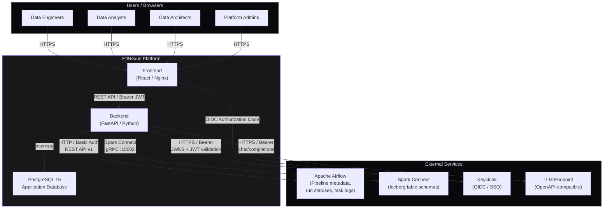

### External Dependency Roles

| Service | Role | Protocol | Auth |
|---|---|---|---|
| **Apache Airflow** | Source of truth for all pipeline metadata, lineage, statuses, Spark metrics, and execution plans | HTTP REST API v1 | HTTP Basic Auth |
| **Spark Connect** | Source of pipeline field schemas via a remote Spark session over the Iceberg hadoop catalog | Spark Connect (gRPC) + Spark SQL | None (internal) |
| **Keycloak** | OIDC authentication, JWT signing, group/team claims | OIDC / JWKS | OIDC Authorization Code (frontend), JWKS (backend) |
| **LLM Endpoint** | AI Architect chat completions and join insights | OpenAPI-compatible `/chat/completions` | Bearer token (optional) |

### What Airflow Provides

Airflow is the only external system that drives persistent data changes in EtlNexus. The backend extracts the following from Airflow at every sync cycle:

- **Pipeline metadata** — `etl_name`, `category`, `schedule` from task `op_kwargs`
- **Lineage (reads_from)** — `needs` list in `params` declares upstream task dependencies
- **Lineage (writes_to)** — `ETL_WRITES_TO:` lines in task execution logs
- **Descriptions** — `ETL_DESCRIPTION:` lines in task logs
- **Bouncer metadata** — bouncer tasks identified by `task_id` pattern; `BOUNCER_DESCRIPTION:` from logs
- **Team assignment** — parsed from `TaskGroup` prefix in DAG source code (`DaggerCollection` → team `Dagger`)
- **Spark resource allocation** — `resources` dict in `op_kwargs` (default + per-DAG overrides)
- **Run history and actual resource usage** — `ETL_RESOURCE_ACTUAL:` JSON in task logs (sparkMeasure output)
- **Spark execution plans** — `ETL_EXECUTION_PLAN:` JSON in task logs (physical plan tree)
- **DAG task graph** — downstream task relationships for topology and consumer discovery

---

## 3. Container Architecture

### Development Environment

The development environment uses Docker Compose with 12 services. The key design decisions are:

- DAG files are **bind-mounted** into both `airflow-webserver` and `airflow-scheduler`, so DAG changes take effect without rebuilding containers.
- The Iceberg warehouse is a **shared Docker volume** (`iceberg-warehouse`) accessed by the scheduler (for Spark ETL writes), `spark-connect` (the Spark Connect server backing the Iceberg hadoop catalog), and the seed jobs. There is no REST catalog — every component reads/writes the same warehouse path via an Iceberg hadoop catalog.
- `spark-volume-init` is an Alpine init container that sets `chmod 1777` on the warehouse volume before `spark-connect` or the seed jobs start, ensuring correct write permissions across containers running as different Unix users.
- `seed-schema` then `seed-data` run as root (`user: "0"`) with `umask 000` to create the Iceberg tables and seed sample data via a local Spark session, then set `chmod -R 777` on the warehouse so `spark-connect` (uid 1000) can read the data.
- The backend **waits for `seed-data` to complete and `spark-connect` to become healthy** before starting, ensuring schemas are queryable on first catalog sync.

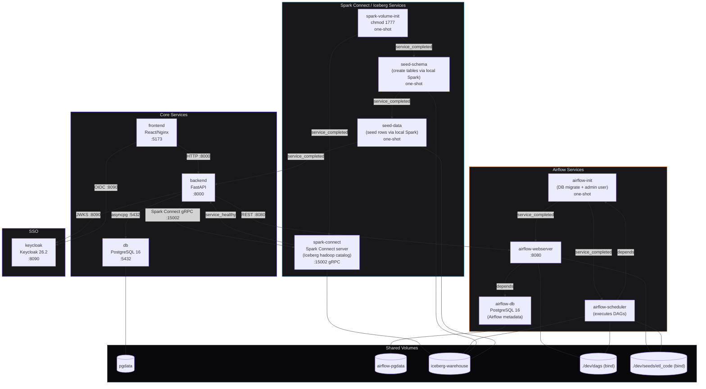

### Port Allocation

| Service | Host Port | Purpose |
|---|---|---|
| `frontend` | 5173 | React SPA (Nginx in production mode) |
| `backend` | 8000 | FastAPI REST API |
| `db` | 5432 | PostgreSQL (EtlNexus application data) |
| `airflow-webserver` | 8080 | Airflow UI and REST API |
| `keycloak` | 8090 | Keycloak admin and OIDC endpoints |
| `spark-connect` | 15002 | Spark Connect server (gRPC) over the Iceberg hadoop catalog |

---

## 4. Backend Architecture

### Three-Layer Pattern

The backend follows a strict three-layer pattern throughout all features. FastAPI dependency injection (`Depends`) wires the layers together at request time.

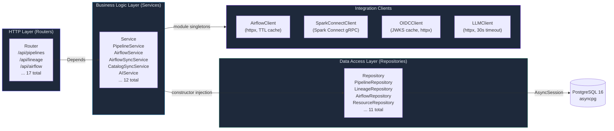

### Dependency Injection Flow

FastAPI's `Depends` mechanism is used throughout. The `dependencies.py` module is the central wiring file that maps service factory functions to their constructor arguments. All database sessions are per-request: `get_db_session()` is an async context manager generator that yields an `AsyncSession`, commits on clean exit, and rolls back on exception.

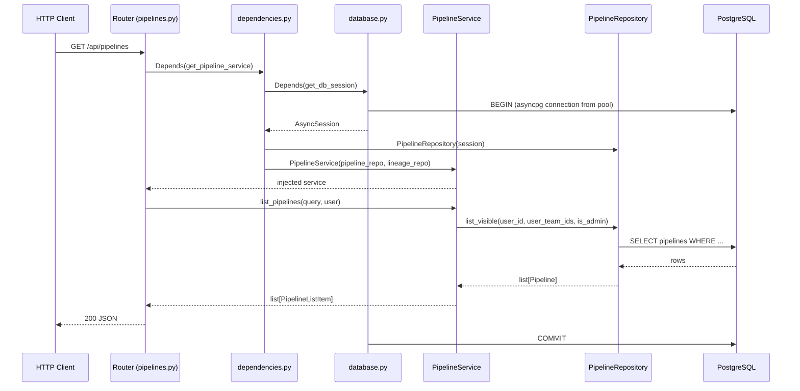

### Router Inventory

All 17 routers are mounted under `/api/`. The table below shows prefix, auth requirement, and primary concern.

| Router file | Prefix | Auth | Concern |
|---|---|---|---|
| `health.py` | `/api/health` | None | Liveness, Airflow/Iceberg connectivity |
| `pipelines.py` | `/api/pipelines` | Required | Pipeline CRUD, sync, join suggestions |
| `lineage.py` | `/api/lineage` | Required | Lineage edges per pipeline |
| `airflow.py` | `/api/airflow` | Required | Status per pipeline |
| `topology.py` | `/api/topology` | Required | DAG topology graph (nodes + edges) |
| `resources.py` | `/api/pipelines/{id}/resources` | Required | Resource configs and run history |
| `dag_summary.py` | `/api/dag-summary` | Required | Per-DAG statistics |
| `schema_matrix.py` | `/api/schema-matrix` | Required | Cross-pipeline field frequency |
| `bouncers.py` | `/api/bouncers` | Required | Bouncer list and topology |
| `metrics.py` | `/api/metrics` | Admin only | Pipeline metrics and statistics |
| `usage.py` | `/api/usage` | Required | Pipeline usage/description by etl_name |
| `consumers.py` | `/api/consumers` | Required | Downstream consumer discovery |
| `ai.py` | `/api/ai` | Required | Chat and join insights |
| `auth.py` | `/api/auth` | Mixed | OIDC config (public), /me (required) |
| `teams.py` | `/api/teams` | Required | Team listing |
| `visibility.py` | `/api/visibility` | Admin only | Visibility grant management |
| `users.py` | `/api/users` | Admin only | User listing and management |

### In-Memory TTL Cache

Between sync cycles (every 20 minutes), read-heavy endpoints use a shared in-memory TTL cache (`backend/app/cache.py`) to avoid redundant database queries. The cache is implemented as a plain Python dictionary with monotonic timestamps. All cache entries are invalidated immediately after each sync/poll cycle completes in the scheduler.

| Cache | TTL | Covers |
|---|---|---|
| `pipeline_list_cache` | 30 s | Pipeline list (no search query) |
| `topology_cache` | 30 s | Topology per pipeline + DAG ID |
| `schema_matrix_cache` | 60 s | Global schema matrix response |
| `dag_summary_cache` | 60 s | DAG summary statistics |
| `bouncer_cache` | 60 s | Bouncer list |
| `bouncer_topology_cache` | 30 s | Bouncer topology |

### AirflowClient Design

The `AirflowClient` (`backend/app/integrations/airflow_client.py`) maintains a persistent `httpx.AsyncClient` with a connection pool (`max_connections=10`, `max_keepalive_connections=5`) to avoid creating new TCP connections per request. Requests use HTTP Basic Auth against the Airflow REST API v1. The client has:

- 2-attempt retry on all requests with a 10-second timeout.
- A 5-minute TTL in-memory cache for `GET /dags`, `GET /dags/{id}/tasks`, `GET /dags/{id}/details` (DAG source), and the derived task-group map.
- Graceful degradation: a failed request logs a warning and returns `None` / empty list rather than raising.

### SparkConnectClient Design

The `SparkConnectClient` (`backend/app/integrations/spark_connect_client.py`) uses a **lazily initialized remote `SparkSession`** that connects to a Spark Connect server over gRPC (`SPARK_CONNECT_URL`, e.g. `sc://spark-connect:15002`) — no local JVM and no Iceberg REST catalog. The server exposes the Iceberg tables through an Iceberg **hadoop** catalog over the shared warehouse volume. Schema discovery is synchronous (PySpark/Spark Connect is not async-native) and runs in the background task context. SQL identifiers are validated against a safe character regex before use in Spark SQL to prevent injection. The client raises `SparkConnectError` on failure.

### OIDCClient Design

The `OIDCClient` (`backend/app/integrations/oidc_client.py`) fetches the Keycloak `.well-known/openid-configuration` on startup, discovers the JWKS URI, and caches all signing keys indexed by `kid` for O(1) lookup with a 6-hour TTL. When a JWT presents an unknown `kid` (key rotation), the cache is refreshed once before failing. Token validation uses `python-jose` with RS256 and accepts both the internal Docker issuer URL (`keycloak:8090`) and the public-facing URL (`localhost:8090`) to handle tokens minted by Keycloak's public hostname.

---

## 5. Frontend Architecture

### Application Structure

The frontend is a single-page React application with six top-level views, controlled by a Zustand navigation store. All views except the Pipeline Registry are code-split via `React.lazy` and wrapped in `Suspense`.

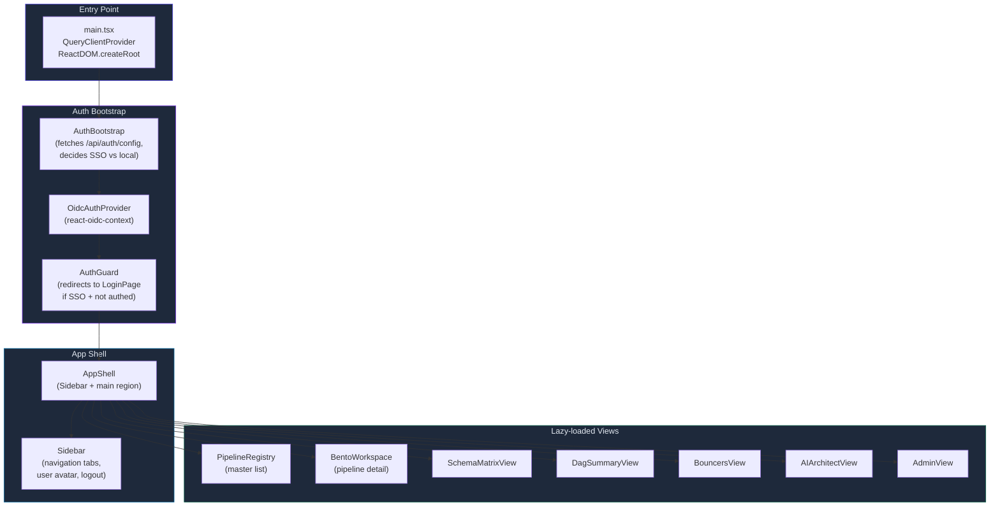

### State Management Strategy

The frontend uses two distinct state layers to avoid mixing server-derived data with client-only UI state.

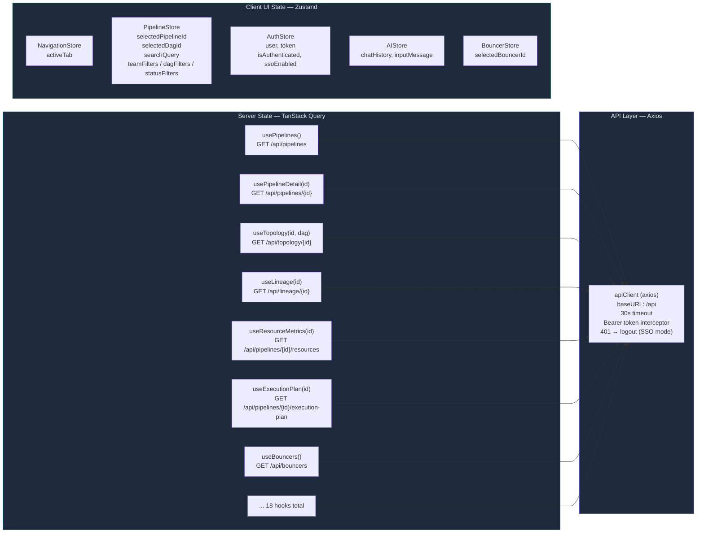

**Why this split:** TanStack Query handles caching, background refetching, loading/error states, and deduplication of in-flight requests automatically. Zustand handles pure UI state that does not need to be synchronized with the server (which tab is active, which pipeline is selected, filter values). This avoids the common mistake of putting server data in client state stores (as Redux patterns often encourage).

### Bento Workspace Component Hierarchy

The Bento Workspace is the most complex view, displaying a 12-column CSS grid of cards for a selected pipeline. Each card is an independent component that fetches its own data via a TanStack Query hook.

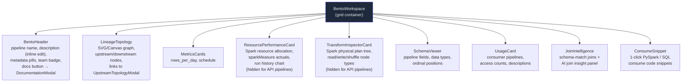

### Auth Bootstrap Flow

The `AuthBootstrap` component decides the authentication mode before rendering any application content.

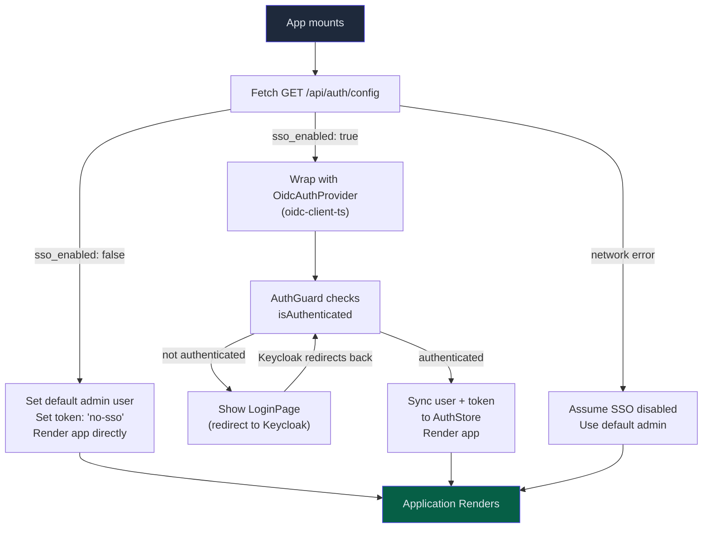

### Axios Client and Token Injection

The Axios client (`frontend/src/api/client.ts`) uses a request interceptor to attach the Bearer token from the Zustand auth store on every outgoing request. A response interceptor handles `401` responses by calling `logout()` on the auth store when SSO is enabled, which causes the `AuthGuard` to show the login page. The token value `"no-sso"` is a sentinel that causes the interceptor to skip the `Authorization` header entirely.

---

## 6. Data Model

### Entity Relationship Diagram

```mermaid
erDiagram
    pipelines {
        uuid id PK
        string name UK
        string task_id IDX
        text description
        string category
        string schedule
        string rows_per_day
        text documentation
        string last_updated_by
        datetime last_updated_at
        string team IDX
        uuid team_id FK
        datetime created_at
        datetime updated_at
    }

    pipeline_fields {
        uuid id PK
        uuid pipeline_id FK
        string name IDX
        string data_type
        int ordinal_position
    }

    lineage_edges {
        uuid id PK
        uuid source_pipeline_id FK
        uuid target_pipeline_id FK
        string source_table
        string target_table
        string edge_type
        datetime discovered_at
    }

    airflow_run_statuses {
        uuid id PK
        uuid pipeline_id FK_UK
        string dag_id
        string status
        datetime execution_date
        datetime last_checked_at
    }

    pipeline_resource_configs {
        uuid id PK
        uuid pipeline_id FK
        string dag_id
        string spark_driver_memory
        string spark_executor_memory
        int spark_executor_cores
        int spark_num_executors
        bool is_dag_override
        datetime synced_at
    }

    pipeline_run_history {
        uuid id PK
        uuid pipeline_id FK
        string dag_id
        string dag_run_id
        float duration_seconds
        datetime start_date
        datetime end_date
        string status
        int driver_memory_used_mb
        int executor_memory_peak_mb
        float cpu_utilization_pct
        int executors_active
        string spark_application_id
        bigint executor_run_time_ms
        bigint executor_cpu_time_ms
        bigint jvm_gc_time_ms
        bigint shuffle_read_bytes
        bigint shuffle_write_bytes
        bigint input_bytes
        bigint output_bytes
        bigint memory_bytes_spilled
        bigint disk_bytes_spilled
        bigint peak_execution_memory
        bigint result_size_bytes
        int num_tasks
        int num_stages
        string metrics_source
        text execution_plan
        datetime recorded_at
    }

    dag_tasks {
        uuid id PK
        string dag_id IDX
        string task_id IDX
        uuid pipeline_id FK
        json downstream_task_ids
        json needs
        json prefers
        string task_group_id
        string bouncer_name
        uuid bouncer_id FK
        datetime synced_at
    }

    bouncers {
        uuid id PK
        string bouncer_name UK
        string display_name
        text description
        string team IDX
        bigint volume_per_day
        string status
        json dag_ids
        datetime created_at
        datetime updated_at
    }

    pipeline_usages {
        uuid id PK
        string etl_name IDX
        string consumer_name
        string usage_type
        text description
        datetime last_accessed_at
        int access_count
        datetime created_at
    }

    users {
        uuid id PK
        string sub UK_IDX
        string email UK_IDX
        string display_name
        string role
        bool is_active
        datetime last_login
        datetime created_at
        datetime updated_at
    }

    teams {
        uuid id PK
        string name UK_IDX
        text description
        string source
        datetime created_at
    }

    user_teams {
        uuid id PK
        uuid user_id FK
        uuid team_id FK
        string role_in_team
        datetime joined_at
    }

    visibility_grants {
        uuid id PK
        uuid grantee_team_id FK
        uuid grantee_user_id FK
        uuid pipeline_id FK
        uuid source_team_id FK
        string grant_level
        string granted_by
        datetime created_at
    }

    pipelines ||--o{ pipeline_fields : "has"
    pipelines ||--o| airflow_run_statuses : "has latest status"
    pipelines ||--o{ lineage_edges : "is source of (writes_to)"
    pipelines ||--o{ lineage_edges : "is target of (reads_from)"
    pipelines ||--o{ pipeline_resource_configs : "has per-DAG config"
    pipelines ||--o{ pipeline_run_history : "has run records"
    pipelines }o--o| teams : "owned by"
    pipelines ||--o{ dag_tasks : "appears as task in"

    teams ||--o{ user_teams : "has members"
    users ||--o{ user_teams : "belongs to"

    dag_tasks }o--o| bouncers : "may reference"

    visibility_grants }o--o| teams : "grantee team"
    visibility_grants }o--o| users : "grantee user"
    visibility_grants }o--o| pipelines : "target pipeline"
    visibility_grants }o--o| teams : "source team"
```

### Key Design Decisions in the Data Model

**`task_id` as the universal pipeline key.** Each pipeline has a `task_id` column (PascalCase, e.g., `SwitchPortCollector`) that corresponds directly to the Airflow task ID. This is the stable identifier used to join data from different Airflow API calls and to match Iceberg table names to pipeline records. The `name` column is a human-readable display name derived from `task_id` (`SwitchPortCollector` → `Switch Port Collector`).

**Lineage edge dual-mode.** `lineage_edges` stores both `source_pipeline_id` (FK to `pipelines`) and `source_table` (raw string). During sync pass 1, only `source_table` is populated; in pass 2, `source_pipeline_id` is resolved by looking up the pipeline with that `task_id`. This allows edges to be created even when the upstream pipeline has not yet been discovered, and updated later when it is.

**`pipeline_run_history` unique constraint.** The table has a unique constraint on `(pipeline_id, dag_id, dag_run_id)` that prevents duplicate records from overlapping sync and poll cycles. The `insert_run_if_new` repository method uses this constraint to detect whether a run record is new, which controls whether log-fetching for actual metrics and execution plans is triggered.

**`pipeline_run_history.execution_plan` as TEXT.** The Spark physical plan is stored as a JSON string (TEXT column) rather than a JSONB column. This avoids PostgreSQL JSONB indexing overhead on a column that is only ever read by ID and never queried. The frontend receives this as a string and parses it client-side into a recursive tree structure.

**`visibility_grants` mutual exclusivity constraints.** Two `CHECK` constraints enforce that exactly one of `pipeline_id` or `source_team_id` is set (the grant target) and exactly one of `grantee_team_id` or `grantee_user_id` is set (the recipient). This models four grant types: team→pipeline, team→source-team, user→pipeline, user→source-team.

**`pipeline_usages` keyed by `etl_name` string, not UUID.** Consumer enrichment data (descriptions, access counts) is matched to pipelines by `etl_name` (string), not by `pipeline_id` (UUID). This is because consumer metadata comes from a different source (seed data / Airflow downstream task lookup) and the join must survive pipeline re-creation during sync cycles that may change UUIDs.

---

## 7. Authentication and Authorization Flow

### Authentication Modes

EtlNexus supports two authentication modes controlled by the `SSO_ENABLED` environment variable:

- **SSO disabled (default for local development):** A stable default admin user is returned on every request without checking credentials. This user has the `admin` role and belongs to no teams (so it sees all pipelines). The Axios client sends a sentinel token `"no-sso"` which the interceptor strips, so no `Authorization` header is sent.
- **SSO enabled (Keycloak OIDC):** The frontend performs an OIDC Authorization Code flow against Keycloak. The resulting JWT is sent as a `Bearer` token. The backend validates the JWT signature against cached JWKS, extracts claims, and JIT-provisions the user record.

### Full SSO Authentication Flow

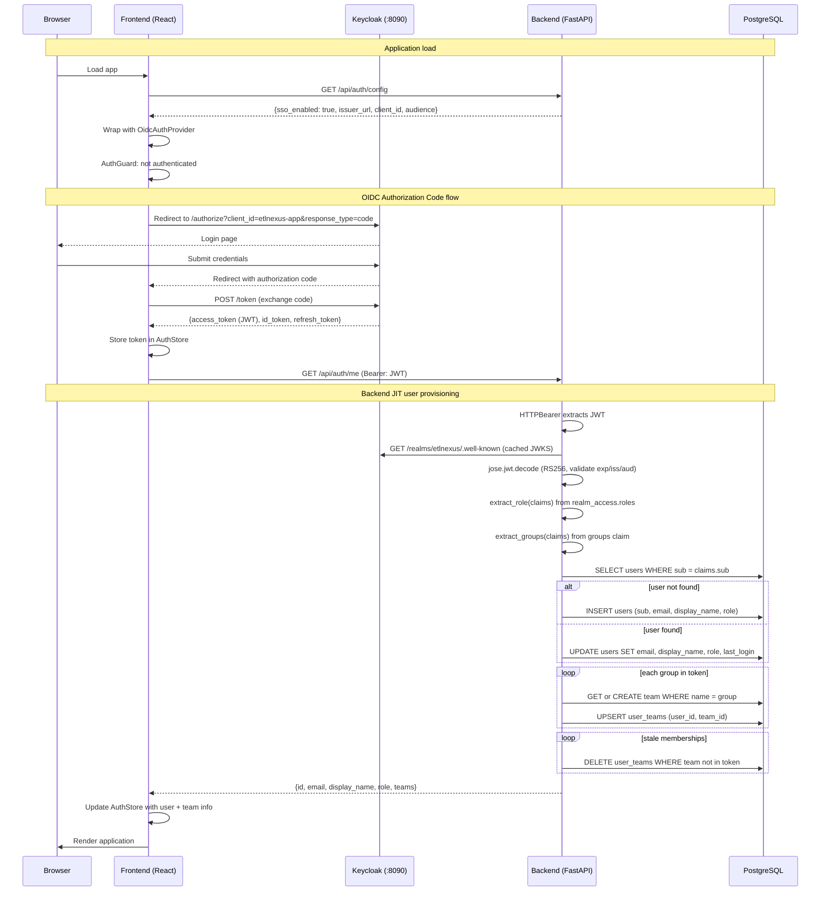

### Authorization Model

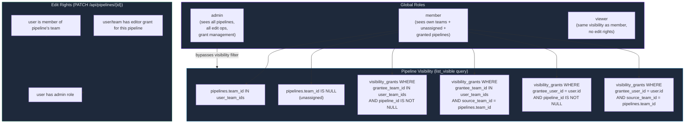

### Team Assignment for Pipelines

Team assignment is derived automatically during Airflow sync. The sync service fetches the DAG Python source via `GET /api/v1/dagSources/{file_token}` and parses `TaskGroup` context manager names using indentation-aware regex. A task with `task_id="SwitchPortCollector"` inside `with TaskGroup("DaggerCollection")` gets its pipeline assigned to the `Dagger` team (longest-prefix matching against known team names).

This design means teams do not need to be manually maintained — they emerge from the structure of the Airflow DAG code and from Keycloak group memberships.

---

## 8. Data Flow Diagrams

### 8.1 Pipeline Discovery (Airflow Sync — 5-Pass Cycle)

This is the most complex data flow in the system and is the primary mechanism by which the EtlNexus database is populated.

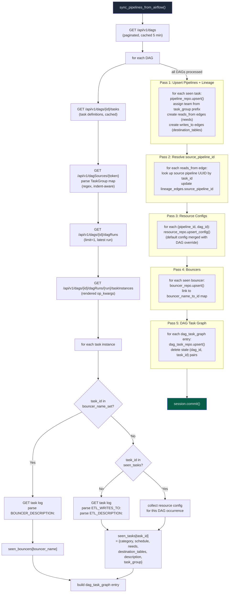

### 8.2 Lineage Resolution Detail

The two-pass lineage approach solves a chicken-and-egg problem: when processing task A which `needs` task B, task B may not yet have been upserted into the `pipelines` table (depending on DAG iteration order). Pass 1 creates edges with only `source_table` (the raw `task_id` string); pass 2 looks up the UUID after all pipelines exist.

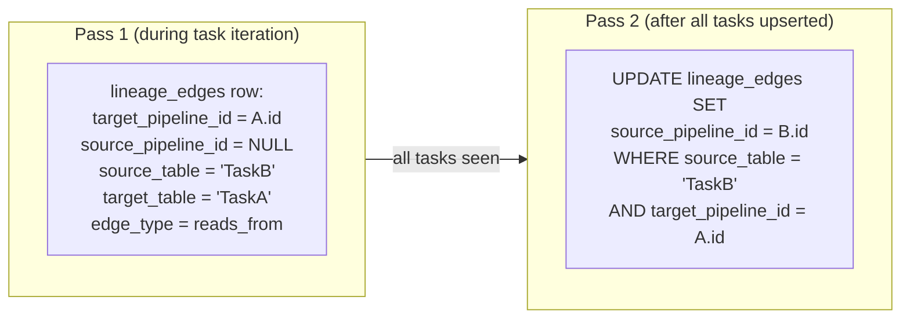

### 8.3 Status Poll Data Flow

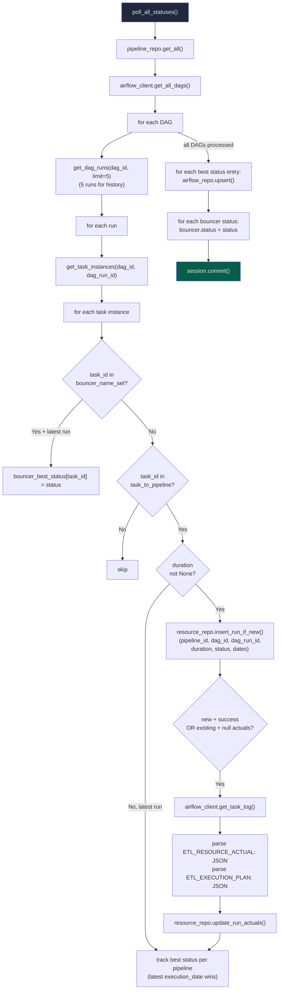

### 8.4 Iceberg Catalog Sync (via Spark Connect)

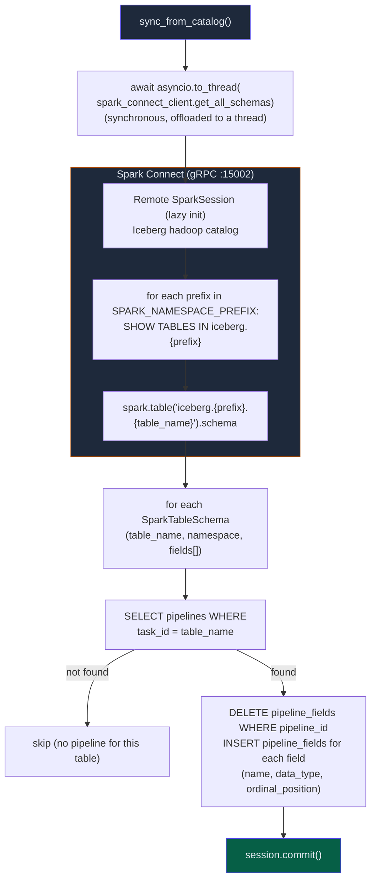

### 8.5 AI Chat Data Flow

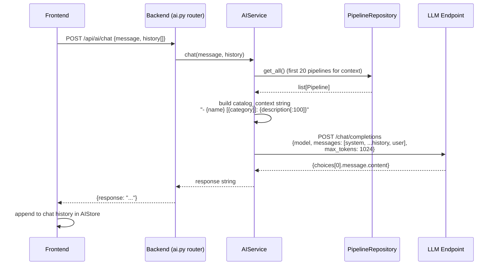

---

## 9. Background Tasks and Scheduling

### Scheduler Configuration

APScheduler's `AsyncIOScheduler` runs on the same asyncio event loop as FastAPI. Three separate `asyncio.Lock` instances guard concurrent execution: `_sync_lock` prevents overlapping sync jobs, `_poll_lock` prevents overlapping poll jobs, and `_mirror_lock` prevents overlapping catalog mirror refreshes. The three CAN run concurrently with each other — they just cannot overlap with themselves. If a job is already in progress when the interval fires, the new invocation is skipped and logs a warning. This prevents race conditions on shared tables (`pipelines`, `airflow_run_statuses`, `pipeline_run_history`) and matters especially for the 30-second mirror, whose Spark read can occasionally exceed its interval.

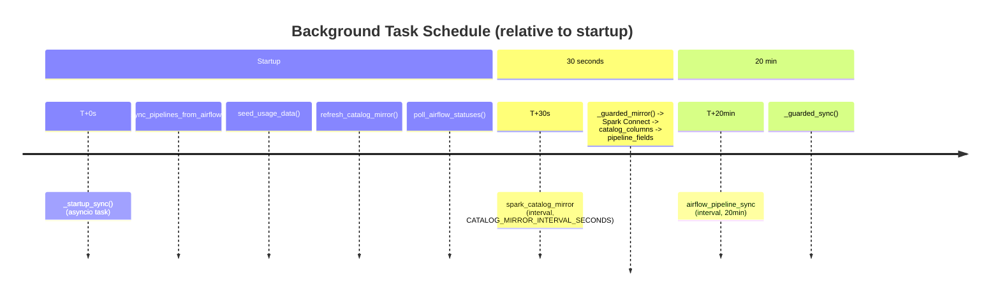

### Startup Sync Ordering

The startup sync sequence in `main.py` has a deliberate ordering:

1. `sync_pipelines_from_airflow()` — must run first to populate the `pipelines` table.
2. `seed_usage_data()` — seeds `pipeline_usages` with consumer enrichment data keyed by `etl_name`; requires pipelines to exist for display name matching.
3. `sync_from_catalog()` — runs after pipeline sync so Iceberg table names can be matched to existing `task_id` values in the database.
4. `poll_airflow_statuses()` — runs last to avoid writing to `airflow_run_statuses` / `pipeline_run_history` before the pipelines exist.

All four tasks run in a background `asyncio.Task` (`asyncio.create_task`) so they do not block application startup. The application will serve `404` responses on detail endpoints and empty lists until the first sync completes (typically within 30-60 seconds on a warm Docker environment).

### Cache Invalidation

After every scheduler-triggered sync/poll cycle, `clear_all()` is called in the `finally` block of `_guarded_sync` and `_guarded_poll`. This ensures that the in-memory TTL caches always reflect the latest sync state within at most one cache TTL period (30-60 seconds) after a sync completes.

---

## 10. Deployment Architecture

### Development vs Production Comparison

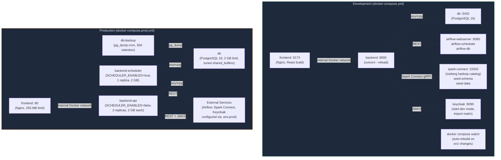

### Key Differences

| Aspect | Development | Production |
|---|---|---|
| Airflow | Docker service (local, seeded DAGs) | External cluster (URL in `.env.prod`) |
| Iceberg | Docker service: `spark-connect` over a local warehouse volume (hadoop catalog) | External Spark Connect server (URL in `.env.prod`) |
| Keycloak | Docker service (dev mode, imported realm) | External Keycloak instance |
| Backend | Single container (API + scheduler) | Separated: `backend-api` (2 replicas) + `backend-scheduler` (1 replica) |
| uvicorn | `--reload` flag for code hot-reload | No reload, fixed workers |
| Frontend | Nginx serving built assets on port 5173 | Nginx on port 80 |
| Database | Default password | `${POSTGRES_PASSWORD}` required, tuned PostgreSQL params |
| Backups | None | Automated `pg_dump` cron (daily, 30-day retention) |
| File watching | `docker compose watch` syncs `./backend/app` into container | Not applicable |
| Logging | JSON log-file driver (50 MB, 5 rotations) | JSON log-file driver |
| Memory limits | None | backend-api: 2 GB x2, backend-scheduler: 2 GB, db: 2 GB, frontend: 256 MB |

### Backend Startup Sequence in Docker

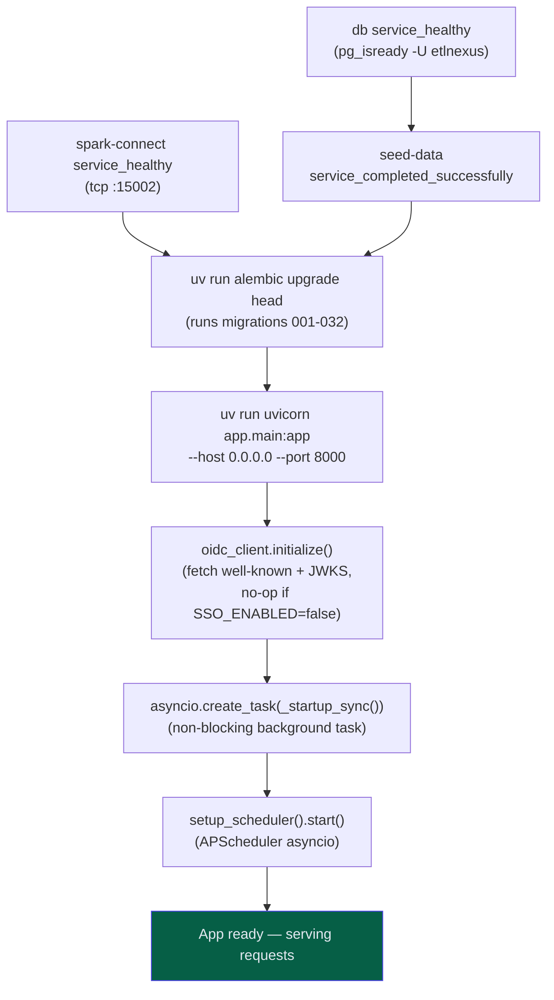

### Nginx Reverse Proxy

In both development and production, the frontend container serves the built React SPA from Nginx. API requests from the browser hit Nginx, which proxies `/api/*` requests to the backend container. This means the browser always communicates with a single origin, avoiding CORS issues. The Vite `VITE_API_BASE_URL` defaults to `/api` which is relative to the browser origin.

---

## 11. Technology Stack Summary

### Backend

| Component | Technology | Version | Purpose |
|---|---|---|---|
| Language | Python | 3.12 | Backend runtime |
| Package manager | uv | latest | Dependency management + virtualenv |
| Web framework | FastAPI | 0.110+ | Async HTTP, routing, DI, OpenAPI docs |
| ASGI server | uvicorn | latest | ASGI server (with `asyncio` event loop) |
| ORM | SQLAlchemy | 2.x (async) | Async ORM with type-mapped models |
| Database driver | asyncpg | latest | Native async PostgreSQL driver |
| Migration tool | Alembic | latest | Schema versioning (32 migrations) |
| HTTP client | httpx | latest | Async HTTP for Airflow, OIDC |
| JWT library | python-jose | latest | RS256 JWT validation |
| Settings | pydantic-settings | latest | `.env` file loading, typed config |
| Scheduler | APScheduler | 3.x | Background task scheduling (asyncio) |
| Spark | Spark Connect / PySpark | 3.5.1 | Iceberg catalog schema sync (remote Spark Connect session over gRPC) |
| Iceberg | iceberg-spark-runtime-3.5 | 1.7.1 | Iceberg hadoop catalog Spark extension |
| sparkMeasure | sparkmeasure | 0.24.0 | Spark task metrics collection |

### Frontend

| Component | Technology | Version | Purpose |
|---|---|---|---|
| Language | TypeScript | 5.x | Type-safe frontend development |
| Package manager | pnpm | latest | Fast dependency management |
| Build tool | Vite | 5.x | Dev server + production build |
| UI framework | React | 19 | Component-based UI |
| Styling | Tailwind CSS | v4 | Utility-first CSS (with `@tailwindcss/vite`) |
| Component library | shadcn/ui (base-ui) | latest | Headless components for React 19 |
| State: server | TanStack Query | 5.x | Server state, caching, background refetch |
| State: client | Zustand | 4.x | Lightweight client UI state stores |
| HTTP client | Axios | latest | HTTP with interceptors for auth |
| OIDC | oidc-client-ts + react-oidc-context | latest | OIDC Authorization Code flow |
| Icons | Lucide React | latest | SVG icon set |
| Code splitting | React.lazy + Suspense | built-in | Per-view lazy loading |

### Infrastructure

| Component | Technology | Version | Purpose |
|---|---|---|---|
| Database | PostgreSQL | 16-alpine | Application persistence |
| Container runtime | Docker + Docker Compose | latest | Development environment orchestration |
| Web server | Nginx | alpine | SPA serving + API reverse proxy |
| Workflow orchestration | Apache Airflow | 2.9+ | Source of truth for pipeline metadata |
| Table format | Apache Iceberg | 1.7.1 | Schema catalog (hadoop catalog via Spark Connect) |
| Identity provider | Keycloak | 26.2 | OIDC SSO, groups, role claims |

### Design Conventions

- **Multi-theme support:** Three themes — dark (default: `#09090b` background, `#18181b` cards, indigo-500 accent), light, and pink — toggled via sidebar icon and persisted in localStorage.
- **PascalCase naming:** All Airflow task IDs and ETL names use PascalCase (e.g., `SwitchPortCollector`). Display names are derived via regex split (`SwitchPortCollector` → `Switch Port Collector`).
- **No Redux:** The project explicitly prohibits Redux. Zustand is used for all client state.
- **No git cloning:** All pipeline metadata is sourced from Airflow. The git integration (clone/pull, AST parser) was removed in an early architectural revision.
- **Airflow log markers:** ETL runners emit structured log lines (`ETL_WRITES_TO:`, `ETL_DESCRIPTION:`, `ETL_RESOURCE_ACTUAL:`, `ETL_EXECUTION_PLAN:`) that the sync service parses during discovery. This avoids needing database columns or API parameters for metadata that is naturally co-located with the task execution.

---

## Appendix: File Path Reference

The following paths are the canonical entry points for each architectural concern.

| Concern | Path |
|---|---|
| Backend app entry | `backend/app/main.py` |
| Backend configuration | `backend/app/config.py` |
| Database setup and session | `backend/app/database.py` |
| Dependency injection wiring | `backend/app/dependencies.py` |
| Authentication and authorization | `backend/app/auth.py` |
| Router definitions | `backend/app/routers/` |
| Service layer | `backend/app/services/` |
| Repository layer | `backend/app/repositories/` |
| SQLAlchemy models | `backend/app/models/` |
| Pydantic schemas (DTOs) | `backend/app/schemas/` |
| Integration clients | `backend/app/integrations/` |
| Background task definitions | `backend/app/tasks/` |
| Scheduler setup | `backend/app/tasks/scheduler.py` |
| In-memory cache | `backend/app/cache.py` |
| Alembic migrations | `backend/alembic/versions/` |
| Frontend entry point | `frontend/src/main.tsx` |
| App root and routing | `frontend/src/App.tsx` |
| Zustand stores | `frontend/src/stores/` |
| TanStack Query hooks | `frontend/src/hooks/` |
| Axios client | `frontend/src/api/client.ts` |
| API function modules | `frontend/src/api/` |
| TypeScript type definitions | `frontend/src/types/` |
| React components | `frontend/src/components/` |
| Auth bootstrap and guard | `frontend/src/components/auth/AuthProvider.tsx` |
| Bento Workspace | `frontend/src/components/bento-workspace/BentoWorkspace.tsx` |
| Development DAG files | `dev/dags/` |
| ETL seed code | `dev/seeds/etl_code/dagger/` |
| Iceberg seed scripts | `dev/seeds/seed_iceberg.py`, `dev/seeds/seed_iceberg_data.py` |
| Keycloak realm config | `dev/keycloak/etlnexus-realm.json` |
| Airflow Dockerfile | `dev/airflow/Dockerfile` |
| Development compose | `docker-compose.yml` |
| Production compose | `docker-compose.prod.yml` |
