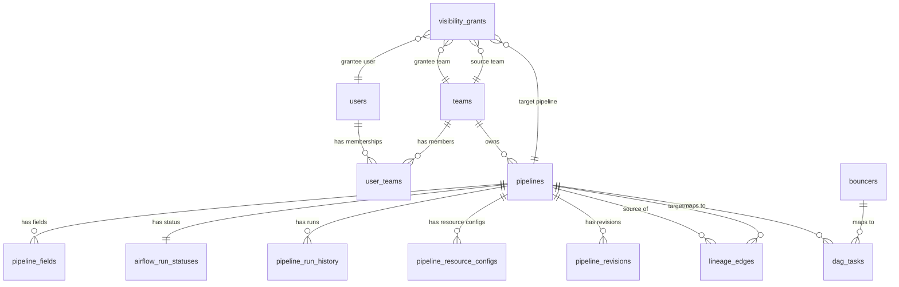

# EtlNexus — Database Schema Reference

PostgreSQL 16 database schema documentation. All tables use UUID primary keys and timezone-aware timestamps.

---

## Table of Contents

1. [Entity Relationship Diagram](#entity-relationship-diagram)
2. [Core Identity Tables](#core-identity-tables)
3. [Pipeline & Data Tables](#pipeline--data-tables)
4. [Status & History Tables](#status--history-tables)
5. [Topology & Lineage Tables](#topology--lineage-tables)
6. [Access Control Tables](#access-control-tables)
7. [Other Tables](#other-tables)
8. [Indexes](#indexes)
9. [Constraints](#constraints)
10. [Migration History](#migration-history)

---

## Entity Relationship Diagram

---

## Core Identity Tables

### `users`

SSO-authenticated user accounts. Created via JIT provisioning on first login.

| Column | Type | Nullable | Default | Description |
|--------|------|----------|---------|-------------|
| `id` | `UUID` | No | `gen_random_uuid()` | Primary key |
| `sub` | `VARCHAR` | No | — | OIDC subject claim (unique) |
| `email` | `VARCHAR` | No | — | User email (unique) |
| `display_name` | `VARCHAR` | No | — | Display name from SSO |
| `role` | `VARCHAR` | No | `'member'` | Global role |
| `is_active` | `BOOLEAN` | No | `true` | Account active status |
| `last_login` | `TIMESTAMP(tz)` | Yes | — | Last login timestamp |
| `created_at` | `TIMESTAMP(tz)` | No | `now()` | Account creation time |
| `updated_at` | `TIMESTAMP(tz)` | No | `now()` | Last update time |

**Constraints:**
- `ck_users_role`: `role IN ('admin', 'member', 'viewer')`
- Unique on `sub`
- Unique on `email`

---

### `teams`

Organizational teams. Synced from SSO groups or created manually.

| Column | Type | Nullable | Default | Description |
|--------|------|----------|---------|-------------|
| `id` | `UUID` | No | `gen_random_uuid()` | Primary key |
| `name` | `VARCHAR` | No | — | Team name (unique) |
| `description` | `TEXT` | Yes | — | Team description |
| `source` | `VARCHAR` | No | `'sso'` | Origin: `sso` or `manual` |
| `created_at` | `TIMESTAMP(tz)` | No | `now()` | Creation time |

**Standard teams:** Dagger, Vault, Prism, Relay, Oasis

---

### `user_teams`

Join table mapping users to teams.

| Column | Type | Nullable | Default | Description |
|--------|------|----------|---------|-------------|
| `id` | `UUID` | No | `gen_random_uuid()` | Primary key |
| `user_id` | `UUID` | No | — | FK → `users.id` (CASCADE) |
| `team_id` | `UUID` | No | — | FK → `teams.id` (CASCADE) |
| `role_in_team` | `VARCHAR` | No | `'member'` | Role within team |
| `joined_at` | `TIMESTAMP(tz)` | No | `now()` | Membership start |

**Constraints:**
- Unique on `(user_id, team_id)`

---

## Pipeline & Data Tables

### `pipelines`

Central pipeline metadata table. One row per ETL pipeline discovered from Airflow.

| Column | Type | Nullable | Default | Description |
|--------|------|----------|---------|-------------|
| `id` | `UUID` | No | `gen_random_uuid()` | Primary key |
| `name` | `VARCHAR` | No | — | Pipeline name (unique, PascalCase) |
| `task_id` | `VARCHAR` | Yes | — | Airflow task ID (indexed) |
| `description` | `TEXT` | Yes | — | Pipeline description |
| `category` | `VARCHAR` | Yes | — | Category (Collection, Enrichment, Analytics, etc.) |
| `schedule` | `VARCHAR` | Yes | — | Cron expression or preset |
| `rows_per_day` | `VARCHAR` | Yes | — | Output volume estimate |
| `documentation` | `TEXT` | Yes | — | Markdown documentation |
| `last_updated_by` | `VARCHAR` | Yes | — | Email of last editor |
| `last_updated_at` | `TIMESTAMP(tz)` | Yes | — | Last edit time |
| `team` | `VARCHAR` | Yes | — | Denormalized team name (for query performance) |
| `team_id` | `UUID` | Yes | — | FK → `teams.id` (SET NULL) |
| `description_edited_by_user` | `BOOLEAN` | No | `false` | Whether user has manually edited description |
| `created_at` | `TIMESTAMP(tz)` | No | `now()` | Discovery time |
| `updated_at` | `TIMESTAMP(tz)` | No | `now()` | Last sync time |

**Indexes:**
- `ix_pipelines_task_id` on `task_id`
- `ix_pipelines_team_id` on `team_id`
- GIN trigram indexes on `name`, `description` for full-text search

---

### `pipeline_fields`

Schema columns for each pipeline, synced from Iceberg catalog.

| Column | Type | Nullable | Default | Description |
|--------|------|----------|---------|-------------|
| `id` | `UUID` | No | `gen_random_uuid()` | Primary key |
| `pipeline_id` | `UUID` | No | — | FK → `pipelines.id` (CASCADE) |
| `name` | `VARCHAR` | No | — | Column name (indexed) |
| `data_type` | `VARCHAR` | Yes | — | Data type (VARCHAR, TIMESTAMP, INT, etc.) |
| `ordinal_position` | `INTEGER` | No | `0` | Column order |

**Indexes:**
- `ix_pipeline_fields_name` on `name`
- GIN trigram index on `name` for partial-match search

---

### `pipeline_revisions`

Audit trail for description and documentation changes.

| Column | Type | Nullable | Default | Description |
|--------|------|----------|---------|-------------|
| `id` | `UUID` | No | `gen_random_uuid()` | Primary key |
| `pipeline_id` | `UUID` | No | — | FK → `pipelines.id` (CASCADE) |
| `field_name` | `VARCHAR` | No | — | `description` or `documentation` |
| `content` | `TEXT` | Yes | — | Content at time of change |
| `changed_by` | `VARCHAR` | No | — | User email or `airflow`/`system` |
| `change_source` | `VARCHAR` | No | — | `user`, `airflow`, or `system` |
| `created_at` | `TIMESTAMP(tz)` | No | `now()` | Revision timestamp |

---

## Status & History Tables

### `airflow_run_statuses`

Latest Airflow execution status per pipeline. One-to-one with `pipelines`.

| Column | Type | Nullable | Default | Description |
|--------|------|----------|---------|-------------|
| `id` | `UUID` | No | `gen_random_uuid()` | Primary key |
| `pipeline_id` | `UUID` | No | — | FK → `pipelines.id` (CASCADE, unique) |
| `dag_id` | `VARCHAR` | No | — | Airflow DAG ID |
| `status` | `VARCHAR` | No | — | `success`, `failed`, `running`, `unknown` |
| `execution_date` | `TIMESTAMP(tz)` | Yes | — | Last execution timestamp |
| `last_checked_at` | `TIMESTAMP(tz)` | No | — | Last poll timestamp |

**Indexes:**
- `ix_airflow_dag_id` on `dag_id`

---

### `pipeline_run_history`

Per-run execution records with Spark metrics and execution plans.

| Column | Type | Nullable | Default | Description |
|--------|------|----------|---------|-------------|
| `id` | `UUID` | No | `gen_random_uuid()` | Primary key |
| `pipeline_id` | `UUID` | No | — | FK → `pipelines.id` (CASCADE) |
| `dag_id` | `VARCHAR` | No | — | Airflow DAG ID |
| `dag_run_id` | `VARCHAR` | No | — | Airflow DAG run ID |
| `duration_seconds` | `FLOAT` | Yes | — | Run duration |
| `start_date` | `TIMESTAMP(tz)` | Yes | — | Run start |
| `end_date` | `TIMESTAMP(tz)` | Yes | — | Run end |
| `status` | `VARCHAR` | No | — | Run outcome |
| **Resource actuals** | | | | |
| `driver_memory_used_mb` | `INTEGER` | Yes | — | Measured driver memory |
| `executor_memory_peak_mb` | `INTEGER` | Yes | — | Peak executor memory |
| `cpu_utilization_pct` | `FLOAT` | Yes | — | CPU utilization percentage |
| `executors_active` | `INTEGER` | Yes | — | Active executor count |
| **Spark internals** | | | | |
| `spark_application_id` | `VARCHAR` | Yes | — | Spark app ID |
| `executor_run_time_ms` | `BIGINT` | Yes | — | Total executor run time |
| `executor_cpu_time_ms` | `BIGINT` | Yes | — | Total executor CPU time |
| `jvm_gc_time_ms` | `BIGINT` | Yes | — | JVM garbage collection time |
| `shuffle_read_bytes` | `BIGINT` | Yes | — | Shuffle read bytes |
| `shuffle_write_bytes` | `BIGINT` | Yes | — | Shuffle write bytes |
| `input_bytes` | `BIGINT` | Yes | — | Total input bytes |
| `output_bytes` | `BIGINT` | Yes | — | Total output bytes |
| `memory_bytes_spilled` | `BIGINT` | Yes | — | Memory spill bytes |
| `disk_bytes_spilled` | `BIGINT` | Yes | — | Disk spill bytes |
| `peak_execution_memory` | `BIGINT` | Yes | — | Peak execution memory |
| `result_size_bytes` | `BIGINT` | Yes | — | Result size bytes |
| `num_tasks` | `INTEGER` | Yes | — | Total Spark tasks |
| `num_stages` | `INTEGER` | Yes | — | Total Spark stages |
| `metrics_source` | `VARCHAR` | Yes | — | `sparkMeasure`, `logs`, etc. |
| **Execution plan** | | | | |
| `execution_plan` | `TEXT` | Yes | — | JSON string of Spark physical plan tree |
| **Snapshots** | | | | |
| `fields_snapshot` | `JSON` | Yes | — | Schema at time of run |
| `source_tables_snapshot` | `JSON` | Yes | — | Source tables at time of run |
| `destination_tables_snapshot` | `JSON` | Yes | — | Destination tables at time of run |
| `recorded_at` | `TIMESTAMP(tz)` | No | `now()` | Record creation time |

**Constraints:**
- Unique on `(pipeline_id, dag_id, dag_run_id)`

**Indexes:**
- Composite index on `(pipeline_id, dag_id, dag_run_id)`
- Index on `dag_id`

---

### `pipeline_resource_configs`

Spark resource allocation per pipeline per DAG.

| Column | Type | Nullable | Default | Description |
|--------|------|----------|---------|-------------|
| `id` | `UUID` | No | `gen_random_uuid()` | Primary key |
| `pipeline_id` | `UUID` | No | — | FK → `pipelines.id` (CASCADE) |
| `dag_id` | `VARCHAR` | No | — | Airflow DAG ID |
| `spark_driver_memory` | `VARCHAR` | Yes | — | e.g., `"2g"`, `"512m"` |
| `spark_executor_memory` | `VARCHAR` | Yes | — | e.g., `"8g"` |
| `spark_executor_cores` | `INTEGER` | Yes | — | Cores per executor |
| `spark_num_executors` | `INTEGER` | Yes | — | Number of executors |
| `is_dag_override` | `BOOLEAN` | No | `false` | Whether this is a DAG-specific override |
| `synced_at` | `TIMESTAMP(tz)` | No | `now()` | Last sync time |

**Constraints:**
- Unique on `(pipeline_id, dag_id)`

---

## Topology & Lineage Tables

### `dag_tasks`

Cached Airflow DAG task graph for topology visualization.

| Column | Type | Nullable | Default | Description |
|--------|------|----------|---------|-------------|
| `id` | `UUID` | No | `gen_random_uuid()` | Primary key |
| `dag_id` | `VARCHAR` | No | — | Airflow DAG ID (indexed) |
| `task_id` | `VARCHAR` | No | — | Airflow task ID (indexed) |
| `pipeline_id` | `UUID` | Yes | — | FK → `pipelines.id` (SET NULL) |
| `downstream_task_ids` | `JSON` | No | `[]` | Direct downstream task IDs |
| `needs` | `JSON` | No | `[]` | Hard dependency task IDs |
| `prefers` | `JSON` | No | `[]` | Soft dependency task IDs |
| `task_group_id` | `VARCHAR` | Yes | — | Airflow TaskGroup name |
| `bouncer_name` | `VARCHAR` | Yes | — | If this task is a bouncer |
| `bouncer_id` | `UUID` | Yes | — | FK → `bouncers.id` (SET NULL) |
| `synced_at` | `TIMESTAMP(tz)` | No | `now()` | Last sync time |

**Constraints:**
- Unique on `(dag_id, task_id)`

**Indexes:**
- `ix_dag_tasks_dag_id` on `dag_id`
- `ix_dag_tasks_task_id` on `task_id`

---

### `lineage_edges`

Data lineage edges (reads_from / writes_to relationships between pipelines and tables).

| Column | Type | Nullable | Default | Description |
|--------|------|----------|---------|-------------|
| `id` | `UUID` | No | `gen_random_uuid()` | Primary key |
| `source_pipeline_id` | `UUID` | Yes | — | FK → `pipelines.id` (SET NULL) |
| `target_pipeline_id` | `UUID` | Yes | — | FK → `pipelines.id` (SET NULL) |
| `source_table` | `VARCHAR` | No | — | Source table name |
| `target_table` | `VARCHAR` | No | — | Target table name |
| `edge_type` | `VARCHAR` | No | — | `reads_from` or `writes_to` |
| `discovered_at` | `TIMESTAMP(tz)` | No | `now()` | Discovery time |

---

## Access Control Tables

### `visibility_grants`

Cross-team/user pipeline access grants. Admin-managed.

| Column | Type | Nullable | Default | Description |
|--------|------|----------|---------|-------------|
| `id` | `UUID` | No | `gen_random_uuid()` | Primary key |
| `grantee_team_id` | `UUID` | Yes | — | FK → `teams.id` (CASCADE) |
| `grantee_user_id` | `UUID` | Yes | — | FK → `users.id` (CASCADE) |
| `pipeline_id` | `UUID` | Yes | — | FK → `pipelines.id` (CASCADE) |
| `source_team_id` | `UUID` | Yes | — | FK → `teams.id` (CASCADE) |
| `grant_level` | `VARCHAR` | No | — | `viewer` or `editor` |
| `granted_by` | `VARCHAR` | No | — | Admin email who created the grant |
| `granted_by_user_id` | `UUID` | Yes | — | FK → `users.id` (SET NULL) |
| `created_at` | `TIMESTAMP(tz)` | No | `now()` | Grant creation time |

**Constraints:**
- `ck_vg_target_xor`: Exactly one of `pipeline_id` / `source_team_id` must be set
- `ck_vg_grantee_xor`: Exactly one of `grantee_team_id` / `grantee_user_id` must be set
- `ck_visibility_grants_grant_level`: `grant_level IN ('viewer', 'editor')`
- `uq_visibility_grant_target_grantee`: Unique on `(grantee_team_id, grantee_user_id, pipeline_id, source_team_id)`

**Indexes:**
- `ix_vg_team_pipeline` on `(grantee_team_id, pipeline_id)` WHERE `pipeline_id IS NOT NULL`
- `ix_vg_team_source` on `(grantee_team_id, source_team_id)` WHERE `source_team_id IS NOT NULL`
- `ix_vg_user_pipeline` on `(grantee_user_id, pipeline_id)` WHERE `pipeline_id IS NOT NULL`
- `ix_vg_user_source` on `(grantee_user_id, source_team_id)` WHERE `source_team_id IS NOT NULL`

---

## Other Tables

### `bouncers`

Root ingestion tasks (data entry points into the pipeline graph).

| Column | Type | Nullable | Default | Description |
|--------|------|----------|---------|-------------|
| `id` | `UUID` | No | `gen_random_uuid()` | Primary key |
| `bouncer_name` | `VARCHAR` | No | — | Bouncer identifier (unique) |
| `display_name` | `VARCHAR` | No | — | Human-readable name |
| `description` | `TEXT` | Yes | — | Bouncer description |
| `team` | `VARCHAR` | Yes | — | Owning team name (indexed) |
| `volume_per_day` | `BIGINT` | Yes | — | Daily ingestion volume |
| `status` | `VARCHAR` | Yes | — | Latest run status |
| `dag_ids` | `JSON` | No | `[]` | DAGs this bouncer appears in |
| `created_at` | `TIMESTAMP(tz)` | No | `now()` | Creation time |
| `updated_at` | `TIMESTAMP(tz)` | No | `now()` | Last update time |

---

### `pipeline_usages`

Downstream consumer tracking (ETL and API consumers of each pipeline).

| Column | Type | Nullable | Default | Description |
|--------|------|----------|---------|-------------|
| `id` | `UUID` | No | `gen_random_uuid()` | Primary key |
| `etl_name` | `VARCHAR` | No | — | Source pipeline name (indexed) |
| `consumer_name` | `VARCHAR` | No | — | Consumer pipeline/API name |
| `usage_type` | `VARCHAR` | No | — | `etl` or `api` |
| `description` | `TEXT` | Yes | — | Usage description |
| `last_accessed_at` | `TIMESTAMP(tz)` | Yes | — | Last access timestamp |
| `access_count` | `INTEGER` | No | `0` | Total access count |
| `created_at` | `TIMESTAMP(tz)` | No | `now()` | Record creation time |

---

## Indexes

### Full-Text Search (GIN Trigram)

These indexes enable fast partial-match search across pipeline names, descriptions, and field names:

| Index | Table | Column | Type |
|-------|-------|--------|------|
| `ix_pipelines_name_gin` | `pipelines` | `name` | GIN trigram |
| `ix_pipelines_description_gin` | `pipelines` | `description` | GIN trigram |
| `ix_pipeline_fields_name_gin` | `pipeline_fields` | `name` | GIN trigram |

### Visibility Query Indexes

Four partial composite indexes optimize the visibility filter query:

| Index | Columns | WHERE |
|-------|---------|-------|
| `ix_vg_team_pipeline` | `(grantee_team_id, pipeline_id)` | `pipeline_id IS NOT NULL` |
| `ix_vg_team_source` | `(grantee_team_id, source_team_id)` | `source_team_id IS NOT NULL` |
| `ix_vg_user_pipeline` | `(grantee_user_id, pipeline_id)` | `pipeline_id IS NOT NULL` |
| `ix_vg_user_source` | `(grantee_user_id, source_team_id)` | `source_team_id IS NOT NULL` |

### Performance Indexes

| Index | Table | Column(s) |
|-------|-------|-----------|
| `ix_pipelines_task_id` | `pipelines` | `task_id` |
| `ix_pipelines_team_id` | `pipelines` | `team_id` |
| `ix_dag_tasks_dag_id` | `dag_tasks` | `dag_id` |
| `ix_dag_tasks_task_id` | `dag_tasks` | `task_id` |
| `ix_airflow_dag_id` | `airflow_run_statuses` | `dag_id` |
| `ix_bouncers_team` | `bouncers` | `team` |
| `ix_pipeline_usages_etl_name` | `pipeline_usages` | `etl_name` |
| `ix_run_history_composite` | `pipeline_run_history` | `(pipeline_id, dag_id, dag_run_id)` |

---

## Constraints

### CHECK Constraints

| Constraint | Table | Rule |
|------------|-------|------|
| `ck_users_role` | `users` | `role IN ('admin', 'member', 'viewer')` |
| `ck_visibility_grants_grant_level` | `visibility_grants` | `grant_level IN ('viewer', 'editor')` |
| `ck_vg_target_xor` | `visibility_grants` | Exactly one of `pipeline_id` / `source_team_id` set |
| `ck_vg_grantee_xor` | `visibility_grants` | Exactly one of `grantee_team_id` / `grantee_user_id` set |

### UNIQUE Constraints

| Constraint | Table | Columns |
|------------|-------|---------|
| `uq_users_sub` | `users` | `sub` |
| `uq_users_email` | `users` | `email` |
| `uq_teams_name` | `teams` | `name` |
| `uq_user_teams` | `user_teams` | `(user_id, team_id)` |
| `uq_pipelines_name` | `pipelines` | `name` |
| `uq_bouncers_name` | `bouncers` | `bouncer_name` |
| `uq_dag_tasks` | `dag_tasks` | `(dag_id, task_id)` |
| `uq_resource_configs` | `pipeline_resource_configs` | `(pipeline_id, dag_id)` |
| `uq_run_history` | `pipeline_run_history` | `(pipeline_id, dag_id, dag_run_id)` |
| `uq_airflow_pipeline` | `airflow_run_statuses` | `pipeline_id` |
| `uq_visibility_grant` | `visibility_grants` | `(grantee_team_id, grantee_user_id, pipeline_id, source_team_id)` |

### Foreign Keys

| Source Table | Column | Target | On Delete |
|-------------|--------|--------|-----------|
| `user_teams` | `user_id` | `users.id` | CASCADE |
| `user_teams` | `team_id` | `teams.id` | CASCADE |
| `pipelines` | `team_id` | `teams.id` | SET NULL |
| `pipeline_fields` | `pipeline_id` | `pipelines.id` | CASCADE |
| `pipeline_revisions` | `pipeline_id` | `pipelines.id` | CASCADE |
| `airflow_run_statuses` | `pipeline_id` | `pipelines.id` | CASCADE |
| `pipeline_run_history` | `pipeline_id` | `pipelines.id` | CASCADE |
| `pipeline_resource_configs` | `pipeline_id` | `pipelines.id` | CASCADE |
| `dag_tasks` | `pipeline_id` | `pipelines.id` | SET NULL |
| `dag_tasks` | `bouncer_id` | `bouncers.id` | SET NULL |
| `lineage_edges` | `source_pipeline_id` | `pipelines.id` | SET NULL |
| `lineage_edges` | `target_pipeline_id` | `pipelines.id` | SET NULL |
| `visibility_grants` | `grantee_team_id` | `teams.id` | CASCADE |
| `visibility_grants` | `grantee_user_id` | `users.id` | CASCADE |
| `visibility_grants` | `pipeline_id` | `pipelines.id` | CASCADE |
| `visibility_grants` | `source_team_id` | `teams.id` | CASCADE |
| `visibility_grants` | `granted_by_user_id` | `users.id` | SET NULL |

---

## Migration History

32 migrations from initial schema to current state:

| # | Migration | Description |
|---|-----------|-------------|
| 001 | `initial_schema` | Base tables: pipelines, fields, lineage, run history |
| 002 | `add_pipeline_usages` | Downstream consumer tracking |
| 003 | `drop_dag_networks` | Remove legacy DAG network table |
| 004 | `drop_code_path` | Remove git code path column |
| 005 | `usage_etl_name` | Rename usage keys to etl_name-based |
| 006 | `add_task_id_to_pipelines` | Add Airflow task_id column |
| 007 | `add_resource_and_run_history` | Spark resource tracking tables |
| 008 | `add_run_history_composite_index` | Performance index on run history |
| 009 | `add_dag_tasks` | DB-backed topology cache table |
| 010 | `add_task_group_id` | TaskGroup support for team/category |
| 011 | `add_sensors` | Sensor (bouncer) table |
| 012 | `expand_run_history_metrics` | Spark internals (shuffle, GC, memory spill) |
| 013 | `add_execution_plan` | Execution plan TEXT column |
| 014 | `add_documentation` | Pipeline documentation column |
| 015 | `add_users_teams` | Users, teams, user_teams tables |
| 016 | `add_team_to_pipelines` | Team FK on pipelines |
| 017 | `add_visibility_grants` | Team-based visibility grants |
| 018 | `add_user_visibility_grants` | User-based visibility grants |
| 019 | `add_grant_level` | Viewer/editor grant levels |
| 020 | `add_role_check_constraints` | CHECK constraints on roles |
| 021 | `add_vg_indexes` | Partial composite indexes for visibility |
| 022 | `add_unique_grant_constraint` | Deduplication constraint |
| 023 | `datetime_timezone` | Timezone-aware timestamps (part 1) |
| 024 | `run_history_tz` | Timezone-aware timestamps (part 2) |
| 025 | `gin_trigram_indexes` | Full-text search optimization |
| 026 | `tz_indexes_granted_by` | Timezone + granted_by FK |
| 027 | `add_pipeline_revisions` | Documentation revision history |
| 028 | `seed_bouncer_volumes` | Seed bouncer volume data |
| 029 | `rename_sensors_to_bouncers` | Rename sensors → bouncers |
| 030 | `standardize_datetime_tz` | UTC standardization |
| 031 | `run_history_snapshots` | Per-run field/table snapshots |
| 032 | `add_dag_id_index` | DAG ID index on airflow_run_statuses |
