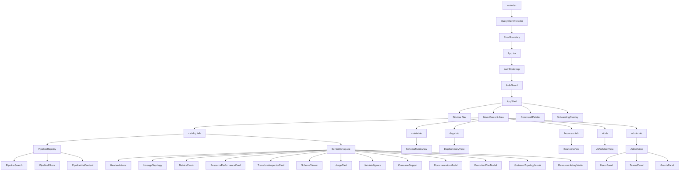
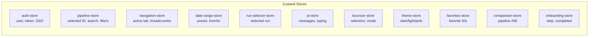
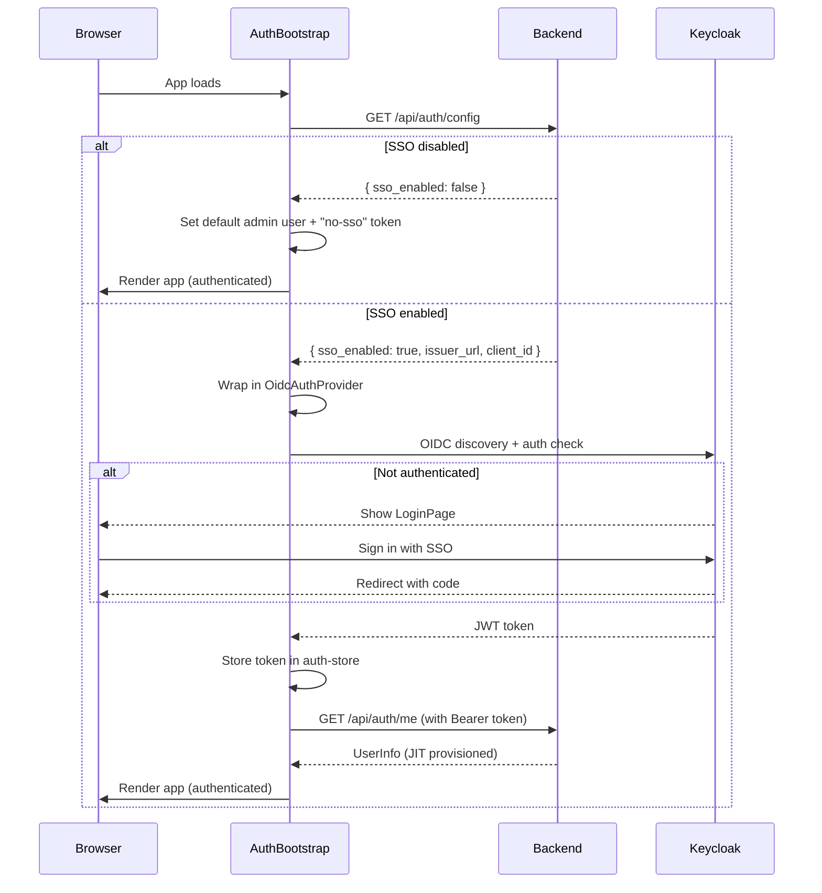

# EtlNexus — Frontend Architecture

React 19 single-page application with TypeScript, Tailwind CSS v4, and shadcn/ui components.

---

## Table of Contents

1. [Technology Stack](#technology-stack)
2. [Directory Structure](#directory-structure)
3. [Component Hierarchy](#component-hierarchy)
4. [State Management](#state-management)
5. [Data Fetching (TanStack Query)](#data-fetching-tanstack-query)
6. [API Client Layer](#api-client-layer)
7. [Authentication Flow](#authentication-flow)
8. [Routing](#routing)
9. [Styling & Theming](#styling--theming)
10. [Key Patterns](#key-patterns)

---

## Technology Stack

| Layer | Technology | Version |
|-------|-----------|---------|
| **Framework** | React | 19.0.0 |
| **Language** | TypeScript | ~5.7.0 |
| **Build** | Vite | 6.0.0 |
| **Package Manager** | pnpm | — |
| **Server State** | TanStack React Query | 5.90.21 |
| **Client State** | Zustand | 5.0.11 |
| **HTTP Client** | Axios | 1.13.6 |
| **UI Components** | shadcn/ui (base-ui) | 1.2.0 |
| **Icons** | Lucide React | 0.577.0 |
| **CSS** | Tailwind CSS | 4.2.1 |
| **Charts** | Recharts | 3.8.0 |
| **Markdown** | react-markdown + remark/rehype | 10.1.0 |
| **Auth** | react-oidc-context + oidc-client-ts | 3.2.0 / 3.1.1 |
| **Virtualization** | TanStack Virtual | 3.13.22 |
| **Toasts** | Sonner | 2.0.7 |
| **Testing** | Vitest + Testing Library | 4.1.0 |
| **E2E** | Playwright | 1.58.2 |

---

## Directory Structure

```
frontend/src/
├── api/                    # Axios API client functions (one file per domain)
│   ├── client.ts           # Base axios instance, interceptors, retry logic
│   ├── pipelines.ts        # Pipeline CRUD operations
│   ├── admin.ts            # User/team/grant management
│   ├── topology.ts         # Dependency topology
│   ├── resources.ts        # Resource metrics and run history
│   ├── execution-plan.ts   # Spark execution plans
│   ├── lineage.ts          # Data lineage
│   ├── ai.ts               # AI chat
│   ├── bouncers.ts         # Bouncer operations
│   ├── consumers.ts        # Downstream consumers
│   ├── usage.ts            # Pipeline usage metrics
│   ├── dag-summary.ts      # DAG aggregate stats
│   ├── schema-matrix.ts    # Field frequency matrix
│   ├── airflow.ts          # Airflow status and sync
│   └── auth.ts             # Auth config and user info
│
├── hooks/                  # TanStack Query hooks (server state)
│   ├── use-pipelines.ts    # Pipeline list, detail, joins, sync, revisions
│   ├── use-admin.ts        # Admin operations (users, teams, grants)
│   ├── use-topology.ts     # Topology queries
│   ├── use-resources.ts    # Resource metrics, runs, history
│   ├── use-execution-plan.ts
│   ├── use-lineage.ts
│   ├── use-ai.ts
│   ├── use-bouncers.ts
│   ├── use-consumers.ts
│   ├── use-usage.ts
│   ├── use-dag-summary.ts
│   ├── use-schema-matrix.ts
│   ├── use-airflow.ts
│   └── use-auth.ts
│
├── stores/                 # Zustand stores (client state)
│   ├── auth-store.ts       # User session, token, SSO state
│   ├── pipeline-store.ts   # Selected pipeline, search, filters
│   ├── navigation-store.ts # Active tab, breadcrumbs, hash routing
│   ├── date-range-store.ts # Global date range preset
│   ├── run-selector-store.ts # Selected run for historical views
│   ├── ai-store.ts         # Chat messages, typing indicator
│   ├── bouncer-store.ts    # Selected bouncers, team filter, topology mode
│   ├── theme-store.ts      # Theme preference (dark/light/pink)
│   ├── favorites-store.ts  # Favorited pipeline IDs
│   ├── comparison-store.ts # Pipeline comparison state
│   └── onboarding-store.ts # Onboarding step and completion
│
├── types/                  # TypeScript interfaces mirroring backend schemas
│   ├── pipeline.ts
│   ├── admin.ts
│   ├── topology.ts
│   ├── resources.ts
│   ├── execution-plan.ts
│   ├── lineage.ts
│   ├── ai.ts
│   ├── airflow.ts
│   ├── bouncer.ts
│   ├── consumer.ts
│   ├── usage.ts
│   ├── dag-summary.ts
│   ├── schema-matrix.ts
│   └── runs.ts
│
├── components/             # React components organized by feature
│   ├── layout/             # App shell, sidebar, breadcrumbs
│   ├── auth/               # Auth bootstrap, guard, login page
│   ├── pipeline-registry/  # Pipeline list, search, filters
│   ├── bento-workspace/    # Pipeline detail workspace (main feature)
│   ├── schema-matrix/      # Field frequency matrix view
│   ├── dag-summary/        # DAG operations dashboard
│   ├── bouncers/           # Bouncer dashboard
│   ├── ai-terminal/        # AI chat interface
│   ├── admin/              # Admin panel (users, teams, grants)
│   ├── comparison/         # Pipeline comparison view
│   ├── onboarding/         # Onboarding overlay
│   ├── shared/             # Reusable components (error states, loading)
│   └── ui/                 # shadcn/ui base components
│
├── lib/                    # Utilities
│   ├── utils.ts            # cn() class merge helper
│   ├── format.ts           # Duration, count, date formatting
│   ├── permissions.ts      # isAdmin() helper
│   ├── config.ts           # Runtime config (AIRFLOW_URL)
│   ├── status-config.ts    # Status color/icon mappings
│   ├── export.ts           # CSV/JSON export utilities
│   └── export-visual.ts    # Screenshot export (html-to-image)
│
├── App.tsx                 # Root component, lazy loading, hash routing
├── main.tsx                # Entry point, QueryClient, providers
└── index.css               # Tailwind imports, custom styles, animations
```

---

## Component Hierarchy



### Main Application Sections

| Tab | Component | Description |
|-----|-----------|-------------|
| `catalog` | `PipelineRegistry` + `BentoWorkspace` | Side-by-side pipeline list and detail |
| `matrix` | `SchemaMatrixView` | Cross-pipeline field frequency |
| `dags` | `DagSummaryView` | DAG operations dashboard |
| `bouncers` | `BouncersView` | Bouncer grid and topology |
| `ai` | `AIArchitectView` | Terminal-style AI chat |
| `admin` | `AdminView` | User, team, and grant management |

### Bento Workspace Cards

The workspace arranges cards in a responsive grid layout:

| Row | Cards | Grid Span |
|-----|-------|-----------|
| 1 | LineageTopology, MetricsCards | 8 + 4 cols |
| 2 | ResourcePerformanceCard | 12 cols (full width) |
| 2.5 | TransformInspectorCard | 12 cols (full width) |
| 3L | SchemaViewer, UsageCard | 4 cols (stacked) |
| 3R | JoinIntelligence, ConsumeSnippet | 8 cols (stacked) |

---

## State Management

EtlNexus separates state into two categories:

### Server State (TanStack Query)

All data from the backend API is managed by TanStack Query hooks. This provides:
- Automatic caching with configurable stale times
- Background refetching
- Pagination via `useInfiniteQuery`
- Optimistic updates for mutations

### Client State (Zustand)

UI-only state that doesn't come from the server:



| Store | Persisted | Key State |
|-------|-----------|-----------|
| `auth-store` | No | `user`, `token`, `isAuthenticated`, `ssoEnabled` |
| `pipeline-store` | URL hash | `selectedPipelineId`, `searchQuery`, `teamFilters`, `dagFilters`, `statusFilters` |
| `navigation-store` | URL hash | `activeTab`, `breadcrumbs` |
| `date-range-store` | No | `preset` (24h/7d/30d/90d/custom), `dateFrom`, `dateTo` |
| `run-selector-store` | URL hash | `selectedDagRunId` (null = latest/live) |
| `ai-store` | No (session) | `messages[]`, `isTyping` |
| `bouncer-store` | No | `selectedBouncers[]`, `teamFilter`, `topologyMode` |
| `theme-store` | localStorage | `theme` (dark/light/pink) |
| `favorites-store` | localStorage | `favoriteIds[]` |
| `comparison-store` | No | `pipelineA`, `pipelineB`, `isComparing` |
| `onboarding-store` | localStorage | `currentStep`, `hasCompleted` |

---

## Data Fetching (TanStack Query)

### Query Configuration (main.tsx)

```typescript
const queryClient = new QueryClient({
  defaultOptions: {
    queries: {
      staleTime: 30_000,          // 30 seconds
      retry: 2,
      refetchOnWindowFocus: false,
    },
  },
});
```

### Hook Summary

| Hook | Type | Cache Key | Stale Time | Refetch |
|------|------|-----------|------------|---------|
| `usePipelines` | `useInfiniteQuery` | `["pipelines", query, dates, filters]` | 5m | 5m |
| `usePipelineDetail` | `useQuery` | `["pipeline", id]` | 1m | — |
| `useTopology` | `useQuery` | `["topology", id, dagId, runId]` | 2m | — |
| `useUpstreamTopology` | `useQuery` | `["upstream-topology", id, dagId]` | 2m | — |
| `useLineage` | `useQuery` | `["lineage", id]` | 5m | — |
| `useResourceMetrics` | `useQuery` | `["resource-metrics", id, dates]` | 5m | — |
| `useResourceHistory` | `useQuery` | `["resource-history", id, dates]` | 5m | — |
| `useExecutionPlan` | `useQuery` | `["execution-plan", id, runId]` | 5m | — |
| `useExecutionPlanRuns` | `useInfiniteQuery` | `["execution-plan-runs", id]` | 5m | — |
| `useRuns` | `useInfiniteQuery` | `["pipeline-runs", id]` | 2m | — |
| `useRunDetail` | `useQuery` | `["run-detail", id, runId]` | 5m | — |
| `useJoinSuggestions` | `useQuery` | `["join-suggestions", id]` | 5m | — |
| `usePipelineConsumers` | `useQuery` | `["pipeline-consumers", name]` | 5m | — |
| `usePipelineUsage` | `useQuery` | `["pipeline-usage", name, dates]` | 5m | — |
| `useSchemaMatrix` | `useInfiniteQuery` | `["schema-matrix", query]` | 5m | — |
| `useDagSummary` | `useQuery` | `["dag-summary", dates]` | 5m | 5m |
| `useBouncers` | `useQuery` | `["bouncers", team]` | 5m | 5m |
| `useBouncerTopology` | `useQuery` | `["bouncer-topology", ...names]` | 30s | 1m |
| `useAirflowStatuses` | `useQuery` | `["airflow-statuses"]` | 5m | 5m |
| `useAdminUsers` | `useInfiniteQuery` | `["admin-users"]` | 2m | — |
| `useAdminTeams` | `useQuery` | `["admin-teams"]` | 2m | — |
| `useAdminGrants` | `useInfiniteQuery` | `["admin-grants"]` | 2m | — |
| `useCurrentUser` | `useQuery` | `["auth", "me", token]` | 5m | — |
| `useRevisions` | `useQuery` | `["revisions", id, field]` | — | — |

### Mutations

| Hook | Action | Invalidates |
|------|--------|-------------|
| `useUpdatePipeline` | PATCH pipeline | `pipeline`, `pipelines` |
| `useSyncPipeline` | POST sync | ~10 query keys (pipeline, topology, resources, etc.) |
| `useRestoreRevision` | POST restore | `pipeline`, `revisions` |
| `useUpdateUserRole` | PATCH role | `admin-users` |
| `useUpdateUserActive` | PATCH active | `admin-users` |
| `useCreateGrant` | POST grant | `admin-grants` |
| `useDeleteGrant` | DELETE grant | `admin-grants` |
| `useAIChat` | POST chat | Uses AI store directly |

---

## API Client Layer

### Base Client (`api/client.ts`)

```
axios instance
  ├── Request interceptor: Inject Bearer token from auth store
  ├── Response interceptor: 401 → token refresh (SSO) or redirect
  └── Response interceptor: 502/503/504 → retry (2 attempts, exponential backoff)
```

**Configuration:**
- Base URL: `VITE_API_BASE_URL` or `/api`
- Timeout: 30 seconds
- Token source: `useAuthStore.getState().token`
- Skip auth header when token is `"no-sso"` (SSO disabled)

### API Function Pattern

Each API module exports pure async functions:

```typescript
// api/pipelines.ts
export async function fetchPipelines(query?: string, skip = 0, limit = 50) {
  const { data } = await apiClient.get<PipelineListResponse>("/pipelines", {
    params: { q: query, skip, limit },
  });
  return data;
}
```

---

## Authentication Flow



### Component Chain

1. **AuthBootstrap** (`AuthProvider.tsx`) — Fetches `/auth/config`, decides SSO vs no-SSO
2. **AuthGuard** (`AuthGuard.tsx`) — If SSO: delegates to SSOGuard; if no-SSO: renders children
3. **SSOGuard** (inside AuthGuard) — Syncs OIDC token to Zustand, fetches user info, shows login if needed

### Default User (SSO disabled)

```json
{
  "id": "local-admin",
  "email": "admin@localhost",
  "display_name": "Local Admin",
  "role": "admin",
  "is_active": true,
  "teams": []
}
```

---

## Routing

EtlNexus uses **hash-based routing** (no React Router). The URL hash encodes the current view state.

### Hash Format

```
#tab/pipelineId/run/dagRunId
```

**Examples:**
- `#catalog` — Pipeline registry
- `#catalog/550e8400-...` — Pipeline detail view
- `#catalog/550e8400-.../run/manual__2026-03-27` — Specific run of a pipeline
- `#matrix` — Schema matrix
- `#dags` — DAG dashboard
- `#bouncers` — Bouncer dashboard
- `#ai` — AI terminal
- `#admin` — Admin panel

### Hash Utilities (`navigation-store.ts`)

| Function | Description |
|----------|-------------|
| `parseHash()` | Parses `location.hash` → `{ tab, pipelineId?, dagRunId? }` |
| `buildHash(tab, pipelineId?, dagRunId?)` | Constructs hash string |

### State ↔ URL Sync

- **Tab changes** → `useNavigationStore().setActiveTab(tab)` → updates hash
- **Pipeline selection** → `usePipelineStore().setSelectedPipelineId(id)` → updates hash
- **Run selection** → `useRunSelectorStore().selectRun(...)` → updates hash
- **Page load** → `App.tsx` parses hash and restores all three states

---

## Styling & Theming

### Tailwind CSS v4

- Import via `@tailwindcss/vite` plugin (no `tailwind.config.js`)
- Path alias: `@/` → `src/`
- Font: Geist Variable (`@fontsource-variable/geist`)

### Theme System

Three themes controlled by `data-theme` attribute on `<html>`:

| Theme | Background | Cards | Accent |
|-------|-----------|-------|--------|
| `dark` (default) | `#09090b` | `#18181b` | indigo-500 |
| `light` | white | gray-50 | indigo-600 |
| `pink` | `#1a0a14` | `#2d1525` | pink-500 |

Theme is persisted in localStorage (`etlnexus:theme`) and toggled via sidebar icon.

### Status Colors

Consistent status styling across the app:

| Status | Dot Color | Glow | Text |
|--------|-----------|------|------|
| `success` | emerald-400 | emerald glow | emerald-400 |
| `failed` | rose-400 | rose glow | rose-400 |
| `running` | amber-400 (pulse) | amber glow | amber-400 |
| `upstream_failed` | orange-400 | orange glow | orange-400 |
| `queued` | sky-400 | sky glow | sky-400 |
| `unknown` | zinc-500 | none | zinc-400 |

### Custom Animations (index.css)

| Animation | Used For |
|-----------|----------|
| `dash` | Animated dashed topology arrows |
| `onboarding-scanline` | Vertical CRT scan effect |
| `onboarding-blink` | Cursor blink in terminal |
| `onboarding-typewriter` | Text reveal animation |
| `onboarding-border-flow` | Animated gradient borders |
| `onboarding-hex-pulse` | Opacity pulse effect |

---

## Key Patterns

### Lazy Loading

All major views are lazy-loaded via `React.lazy()` in `App.tsx`:

```typescript
const BentoWorkspace = lazy(() => import("./components/bento-workspace/BentoWorkspace"));
const SchemaMatrixView = lazy(() => import("./components/schema-matrix/SchemaMatrixView"));
const DagSummaryView = lazy(() => import("./components/dag-summary/DagSummaryView"));
// etc.
```

### Infinite Scroll Pagination

Lists with large datasets use `useInfiniteQuery` with a "load more" trigger:

```
Pipeline list (PAGE_SIZE=50)
Schema matrix (PAGE_SIZE=100)
Admin users (PAGE_SIZE=100)
Admin grants (PAGE_SIZE=100)
Pipeline runs (PAGE_SIZE=20)
Execution plan runs (PAGE_SIZE=20)
```

### Virtual Scrolling

The pipeline list and schema matrix use `@tanstack/react-virtual` for efficient rendering of long lists.

### Build Optimization (vite.config.ts)

Manual chunk splitting for optimal caching:

| Chunk | Contents |
|-------|----------|
| `vendor-react` | react, react-dom |
| `vendor-query` | @tanstack/react-query |
| `vendor-ui` | @base-ui/react, lucide-react, class-variance-authority, clsx, tailwind-merge |

### Command Palette

`Cmd+K` / `Ctrl+K` opens a command palette for quick navigation between tabs and pipelines.

### Deep Linking

Full application state is encoded in the URL hash, enabling:
- Direct links to specific pipelines: `#catalog/pipeline-uuid`
- Direct links to specific runs: `#catalog/pipeline-uuid/run/dag-run-id`
- Shareable URLs that restore exact view state
